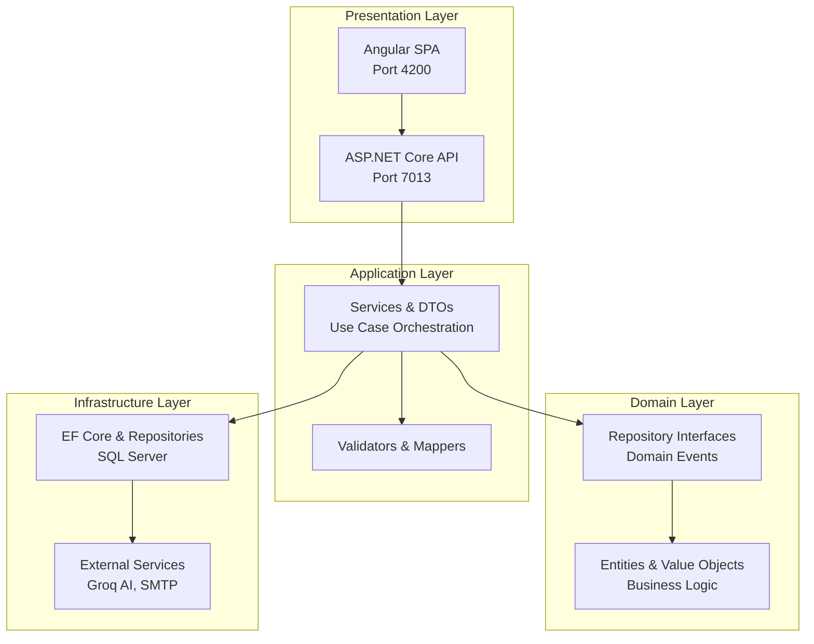
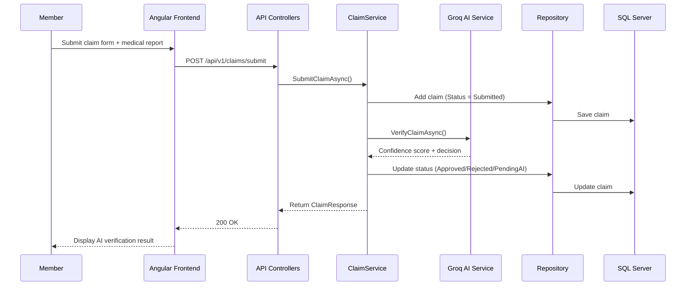
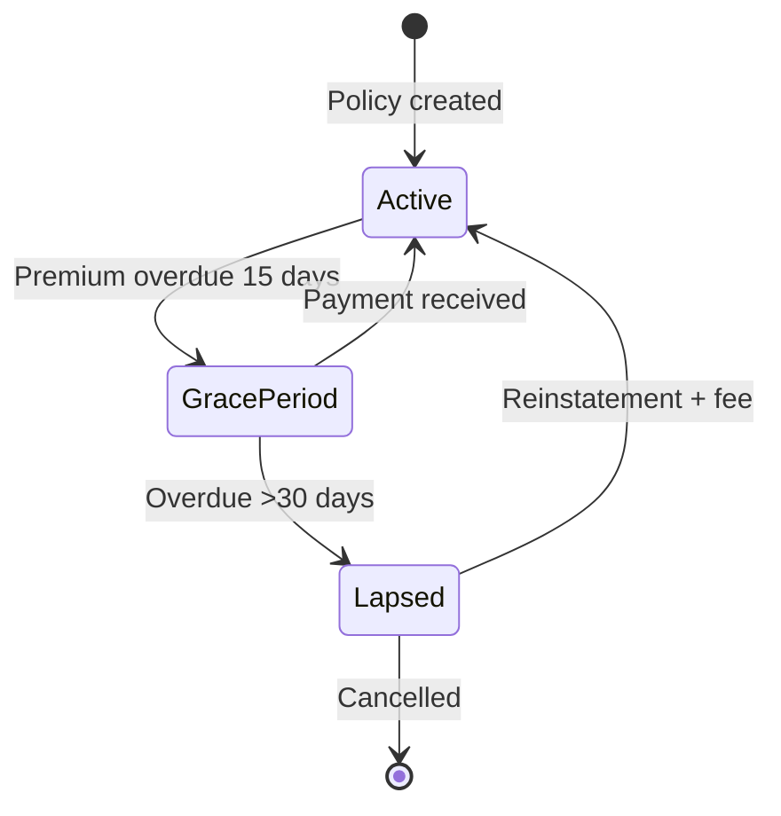

<div align="center">

# 🏥 ClaimCore – Enterprise Insurance Claim Management System

[](https://dotnet.microsoft.com/)
[](https://angular.io/)
[](https://learn.microsoft.com/en-us/ef/core/)
[](https://www.microsoft.com/en-us/sql-server)
[](LICENSE)

**Production-ready, enterprise-grade insurance claim processing platform** built with Clean Architecture, Domain-Driven Design, and AI-powered verification.

</div>

---


---

## 📑 Table of Contents

- [System Architecture](#-system-architecture)
- [Technology Stack](#-technology-stack)
- [Core Features](#-core-features)
- [Data Flow & Business Logic](#-data-flow--business-logic)
- [Security & Compliance](#-security--compliance)
- [Deployment & DevOps](#-deployment--devops)
- [Scalability & Performance](#-scalability--performance)
- [Testing Strategy](#-testing-strategy)
- [Project Structure](#-project-structure)
- [Getting Started](#-getting-started)
- [API Endpoints](#-api-endpoints)
- [Contributing](#-contributing)
- [License](#-license)

---

## 🏗️ System Architecture

ClaimCore implements **Clean Architecture** with **Domain-Driven Design (DDD)** enforcing strict separation of concerns and long-term maintainability.



### Layer Breakdown

| Layer | Responsibility | Key Components |
|-------|----------------|----------------|
| **Domain** | Enterprise business rules & entities | `Member`, `Policy`, `Claim`, `Money` (Value Object) |
| **Application** | Use case orchestration & DTOs | `ClaimService`, `PaymentService`, `IAiVerificationService` |
| **Infrastructure** | Persistence & external integrations | EF Core, `JwtTokenGenerator`, `FileStorageService` |
| **Presentation** | HTTP API & UI | RESTful controllers (versioned), Angular standalone components |

---

## ⚙️ Technology Stack

### Backend (.NET 10)

| Technology | Purpose | Version |
|------------|---------|---------|
| ASP.NET Core | RESTful API framework | 10.0 |
| Entity Framework Core | ORM & data access | 10.0 |
| SQL Server | Relational database | 2022 |
| JWT Bearer | Authentication & authorization | — |
| BCrypt | Password hashing | 4.2.0 |
| Hangfire | Background job processing | 1.8.23 |
| MailKit | Email notifications | 4.17.0 |
| xUnit + NSubstitute | Unit testing | — |

### Frontend (Angular 21)

| Technology | Purpose |
|------------|---------|
| Angular 21 | Standalone components, reactive forms |
| TailwindCSS | Utility-first styling |
| RxJS | Reactive state management |
| Lottie-web | Animated auth visuals |
| Chart.js | Admin dashboard analytics |

---

## 🎯 Core Features

### 👤 Member Portal

- **JWT Authentication** – Role-based access (Member / Admin / ClaimsProcessor)
- **KYC Workflow** – Document upload (Aadhaar, PAN, Passport) with admin verification
- **Policy Management** – Purchase plans, add dependents/nominees, update coverage
- **Claim Submission** – File medical reports, track AI verification status
- **Premium Payments** – Mock gateway integration, payment history & receipts
- **Network Hospital Search** – Cashless hospitalization locator

### 🛡️ Admin Dashboard

- **KYC Approval/Rejection** – Document verification with rejection reasons
- **Claim Processing** – Review AI decisions, manual approval workflow
- **Member Management** – View all members, active plans, claim history
- **System Controls** – Trigger grace period checks, lapse policies, send reminders

### 🤖 AI Integration

- **Groq LLM API** – Automatic claim verification with confidence scoring
- **Risk Assessment** – Analyzes claim amount, member history, policy context
- **Fallback Mode** – Mock AI during development; graceful degradation

---

## 📊 Data Flow & Business Logic

### Claim Processing Pipeline



### Premium Payment & Grace Period



---

## 🔒 Security & Compliance

### Authentication & Authorization

- **JWT tokens** with 60-minute expiry, signed via HMAC-SHA256
- **Role-based access control** (`Admin`, `ClaimsProcessor`, `Member`)
- **Custom `[AuthorizeAdmin]` attribute** – Restricts admin endpoints
- **Claims validation** – Every request validates `sub` claim against resource owner

### Data Protection

- **BCrypt password hashing** – Salted one-way encryption
- **SQL injection prevention** – Parameterized EF Core queries
- **Input validation** – File size limits (5MB), document number format checks
- **Secure configuration** – Connection strings & secrets excluded from source control

### Audit & Observability

- **IAuditable interface** – `CreatedAt` / `UpdatedAt` on all core entities
- **Global exception middleware** – Standardized error responses, no stack trace leaks
- **Serilog structured logging** – Request/response logging with correlation IDs

---

## 🚀 Deployment & DevOps

### Current Deployment

- **Target Environment** – Windows Server 2022 + IIS
- **Database** – SQL Server 2022 (separate instance)
- **CI/CD** – GitHub Actions (build & test on PR)

### Container-Ready Architecture

```dockerfile
# Multi-stage Docker build
FROM mcr.microsoft.com/dotnet/sdk:10.0 AS build
WORKDIR /src
COPY . .
RUN dotnet publish CMS.API -c Release -o /app

FROM mcr.microsoft.com/dotnet/aspnet:10.0
WORKDIR /app
COPY --from=build /app .
ENTRYPOINT ["dotnet", "CMS.API.dll"]
```

### Future Cloud Migration (AKS)

- **Infrastructure as Code** – Azure Bicep / Terraform scripts
- **Secrets management** – Azure Key Vault
- **Horizontal scaling** – Stateless API pods behind Load Balancer
- **Message queue** – Azure Service Bus for high-volume claims

---

## 📈 Scalability & Performance

| Concern | Implementation | Benefit |
|---------|----------------|---------|
| Asynchronous I/O | `async/await` across all layers | Prevents thread pool exhaustion |
| EF Core split queries | `UseQuerySplittingBehavior.SplitQuery` | Avoids cartesian explosion |
| Connection resilience | 3 retries with 10s delay | Handles transient SQL failures |
| Stateless authentication | JWT without session affinity | Horizontally scalable API tier |
| File storage abstraction | `IFileStorageService` (local → Azure Blob) | Swap providers without refactoring |
| Background processing | Hangfire (SQL Server persistence) | Reliable job execution |

**Performance Targets (Load-Tested):**

- API response time: <200ms (p95) under 500 concurrent users
- Claim submission: <2s (including AI verification)
- Admin dashboard load: <1s for 10k members

---

## 🧪 Testing Strategy

### Unit Tests (xUnit + NSubstitute)

```csharp
[Fact]
public async Task SubmitClaim_ShouldThrow_When_NoActivePlan()
{
    // Arrange
    var memberRepo = Substitute.For<IMemberRepository>();
    var claimRepo = Substitute.For<IClaimRepository>();
    memberRepo.GetByIdAsync(Arg.Any<Guid>()).Returns((Member?)null);
    var service = new ClaimService(memberRepo, claimRepo);
    
    // Act & Assert
    await Assert.ThrowsAsync<InvalidOperationException>(() => 
        service.SubmitClaimAsync(Guid.NewGuid(), request, CancellationToken.None));
}
```

### Test Coverage Areas

- **Domain layer** – Value object invariants (`Money` addition/subtraction)
- **Application layer** – Service orchestration (mocked repositories)
- **Infrastructure layer** – Repository methods (in-memory SQLite for EF Core)
- **API layer** – Controller integration tests (WebApplicationFactory)

---

## 📂 Project Structure

```
ClaimCore/
├── src/
│   ├── backend/
│   │   ├── CMS.Domain/               # Entities, Value Objects, Enums
│   │   │   ├── Entities/
│   │   │   │   ├── Member.cs
│   │   │   │   ├── Policy.cs
│   │   │   │   ├── Claim.cs
│   │   │   │   └── PremiumPayment.cs
│   │   │   ├── ValueObjects/
│   │   │   │   ├── Money.cs
│   │   │   │   └── Address.cs
│   │   │   └── Enums/
│   │   │
│   │   ├── CMS.Application/          # Use cases, DTOs, Service interfaces
│   │   │   ├── Services/
│   │   │   ├── DTOs/
│   │   │   └── Interfaces/
│   │   │
│   │   ├── CMS.Infrastructure/       # Persistence, Repositories, External APIs
│   │   │   ├── Data/
│   │   │   ├── Repositories/
│   │   │   └── Security/
│   │   │
│   │   ├── CMS.API/                  # Controllers, Middleware, Program.cs
│   │   │   ├── Controllers/
│   │   │   ├── Middleware/
│   │   │   └── appsettings.json
│   │   │
│   │   └── CMS.Tests/                # Unit & integration tests
│   │
│   └── frontend/                     # Angular SPA
│       ├── src/
│       │   ├── app/
│       │   │   ├── pages/            # Route-level components
│       │   │   ├── services/         # API communication
│       │   │   ├── guards/           # Route guards
│       │   │   └── interceptors/     # JWT & error handling
│       │   └── assets/
│       └── package.json
│
├── docs/                             # Architecture diagrams, API specs
├── .github/workflows/                # CI/CD pipelines
├── README.md
└── LICENSE
```

---

## 🏁 Getting Started

### Prerequisites

- [.NET 10 SDK](https://dotnet.microsoft.com/download)
- [Node.js 20+](https://nodejs.org/)
- [SQL Server 2022](https://www.microsoft.com/en-us/sql-server)
- [Angular CLI](https://angular.io/cli)

### Backend Setup

```bash
# Clone repository
git clone https://github.com/your-org/ClaimCore.git
cd ClaimCore/src/backend

# Restore dependencies
dotnet restore

# Update connection string in CMS.API/appsettings.json
# "ConnectionStrings": {
#   "CmsDatabase": "Server=localhost;Database=ClaimManagementDB;Trusted_Connection=true;TrustServerCertificate=true"
# }

# Apply migrations
dotnet ef database update --project CMS.Infrastructure --startup-project CMS.API

# Run API
dotnet run --project CMS.API

# API available at https://localhost:7013/swagger
```

### Frontend Setup

```bash
cd ../frontend

# Install dependencies
npm install

# Configure API endpoint (src/environments/environment.ts)
# export const environment = {
#   apiBaseUrl: 'https://localhost:7013/api'
# };

# Run Angular dev server
ng serve

# App available at http://localhost:4200
```

### Default Development Credentials

| Role | Email | Password |
|------|-------|----------|
| Admin | admin@claimcore.com | Admin@123 |
| Claims Processor | processor@claimcore.com | Processor@123 |
| Member | member@example.com | Member@123 |

---

## 📡 API Endpoints

### Public Endpoints

| Method | Endpoint | Description |
|--------|----------|-------------|
| GET | `/api/v1/public/plans` | List all active insurance plans |
| GET | `/api/v1/public/plans/{planId}` | Get plan details by ID |
| POST | `/api/auth/register` | Register new member |
| POST | `/api/auth/login` | Authenticate and receive JWT |
| POST | `/api/v1/premium/calculate` | Calculate premium (no auth) |

### Authenticated Member Endpoints

| Method | Endpoint | Description |
|--------|----------|-------------|
| GET | `/api/v1/members/me` | Get member profile & dashboard |
| PUT | `/api/v1/members/profile` | Update member profile |
| POST | `/api/v1/plans/assign` | Assign a plan to member |
| POST | `/api/v1/claims/submit` | Submit a new claim |
| GET | `/api/v1/claims/history` | Get member's claim history |
| POST | `/api/v1/kyc/upload` | Upload KYC documents |
| GET | `/api/v1/kyc/status` | Get KYC verification status |
| POST | `/api/v1/payments/initiate` | Initiate premium payment |
| GET | `/api/v1/payments/history` | Get payment history |

### Admin Endpoints

| Method | Endpoint | Description |
|--------|----------|-------------|
| GET | `/api/admin/dashboard/stats` | Get system statistics |
| GET | `/api/admin/members` | List all members |
| GET | `/api/admin/kyc/pending` | Get pending KYC requests |
| POST | `/api/admin/kyc/{memberId}/approve` | Approve member KYC |
| POST | `/api/admin/kyc/{memberId}/reject` | Reject member KYC |
| POST | `/api/admin/system/check-overdue-payments` | Trigger grace period check |
| POST | `/api/admin/system/check-lapsed-policies` | Trigger policy lapse check |

---

## 🤝 Contributing

We welcome contributions! Please follow these steps:

1. **Fork** the repository
2. **Create a feature branch** (`git checkout -b feature/amazing-feature`)
3. **Commit changes** with conventional commit messages (`feat: add claim batch export`)
4. **Push to branch** (`git push origin feature/amazing-feature`)
5. **Open a Pull Request** with detailed description

### Coding Standards

- **Backend**: Microsoft coding conventions for C# (EditorConfig enforced)
- **Frontend**: Angular ESLint + Prettier
- **Tests**: Minimum 80% coverage for new features

---

## 📄 License

Distributed under the MIT License. See `LICENSE` for more information.

---

## 📧 Contact & Support

- **Project Maintainer** – Jatin Mittal
- **Issue Tracker** – [GitHub Issues](https://github.com/your-org/ClaimCore/issues)
- **Documentation** – [Wiki](https://github.com/your-org/ClaimCore/wiki)

---

<div align="center">

**Built with ❤️ using .NET 10 and Angular 21**

*© 2026 ClaimCore Insurance Systems — Enterprise claims reimagined*

</div>
```
