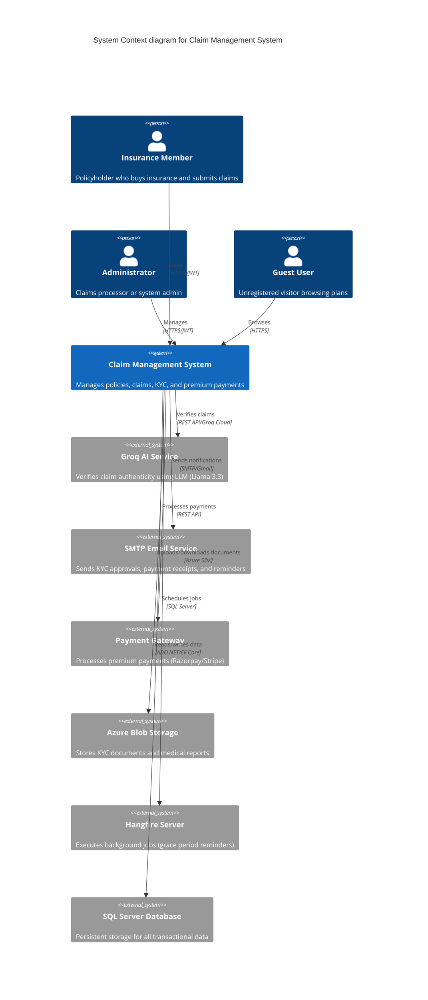
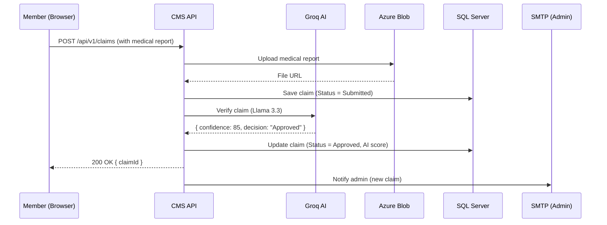
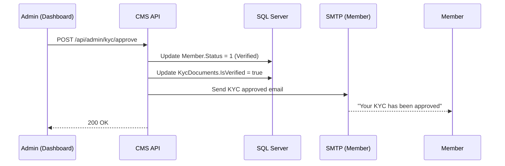
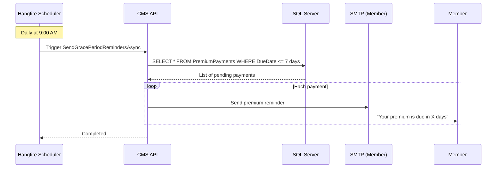

# System Context – C4 Level 1

## Overview

The Claim Management System (CMS) is an enterprise-scale insurance platform that enables members to purchase health policies, submit claims, and track settlements. Administrators manage KYC verification, claims processing, and policy configurations.

This document uses the **C4 model** (Context, Containers, Components, Code) at Level 1 – showing the system's boundaries and external integrations.

---

## System Context Diagram (Mermaid)



---

## External Actors

### Primary Actors

| Actor | Description | Interactions | Authentication |
|-------|-------------|--------------|----------------|
| Insurance Member | Registered policyholder | Purchases policies, submits claims, views documents, makes premium payments | JWT token (from login) |
| Administrator | Claims processor or admin | Approves KYC, processes claims, configures plans, views analytics | JWT token + Admin role claim |
| Guest User | Unregistered visitor | Browses public plans, calculates premium estimates | None (anonymous) |

### Secondary Actors (Supporting)

| Actor | Description | Trigger | Frequency |
|-------|-------------|---------|-----------|
| Groq AI Service | LLM-based claim verifier | Every claim submission | Real-time |
| SMTP Email Service | Email delivery (Gmail SMTP) | KYC approval, payment confirmation, reminders | Async |
| Payment Gateway | Mock payment processor | Premium payment initiation | Real-time |
| Azure Blob Storage | Document storage | KYC upload, medical report upload | Real-time |
| Hangfire Server | Background job processor | Grace period reminders (daily), overdue payment checks (hourly) | Scheduled |
| SQL Server | Primary database | All data operations | Real-time |

---

## External System Details

### 1. Groq AI Service (Claim Verification)

**Purpose:** Automates claim approval using LLM (Llama 3.3 70B)

**Configuration:** `src/backend/CMS.API/appsettings.json` lines 19-27

```json
"AI": {
    "Provider": "Groq",
    "ApiKey": "",
    "BaseUrl": "https://api.groq.com/openai/v1",
    "Model": "llama-3.3-70b-versatile",
    "UseMockInDevelopment": true,
    "ConfidenceThreshold": 90
}
```

**Integration Pattern:** REST API with JSON payload

**File:** `src/backend/CMS.Application/Services/GrokAiVerificationService.cs` lines 47-75

```csharp
var response = await _httpClient.PostAsync(
    $"{_baseUrl}/chat/completions",
    httpContent,
    cancellationToken);
```

- **Fallback:** Mock mode when `UseMockInDevelopment: true` (lines 37-45)
- **SLA:** 45-second timeout (line 28)

---

### 2. SMTP Email Service (Gmail)

**Purpose:** Send transactional emails (KYC, payments, claims)

**Configuration:** `src/backend/CMS.API/appsettings.json` lines 29-36

```json
"EmailSettings": {
    "SmtpServer": "smtp.gmail.com",
    "SmtpPort": 587,
    "Username": "jatinmittal0717@gmail.com",
    "Password": "fmmgyjmulybjxnay",
    "FromEmail": "noreply@claimcore.comm",
    "FromName": "ClaimCore Insurance",
    "AdminEmail": "mittaljatin2004@gmail.com"
}
```

**Integration Pattern:** SMTP with STARTTLS

**File:** `src/backend/CMS.Application/Services/EmailService.cs` lines 185-210

```csharp
using var smtp = new SmtpClient();
await smtp.ConnectAsync(_configuration["EmailSettings:SmtpServer"],
    int.Parse(_configuration["EmailSettings:SmtpPort"]),
    SecureSocketOptions.StartTls);
```

**Email Types:**

| Email Type | Trigger | File Reference |
|------------|---------|----------------|
| KYC Approved | Admin action | `EmailService.cs` lines 13-38 |
| KYC Rejected | Admin action | `EmailService.cs` lines 40-65 |
| Premium Reminder | Grace period service | `EmailService.cs` lines 67-92 |
| Policy Created | Registration with plan | `EmailService.cs` lines 94-119 |
| Payment Confirmation | Payment completion | `EmailService.cs` lines 121-146 |
| Policy Lapsed | 30+ days overdue | `EmailService.cs` lines 176-201 |
| OTP Verification | Document upload | `EmailService.cs` lines 148-174 |

---

### 3. Payment Gateway (Mock)

**Purpose:** Process premium payments (currently mock implementation)

**Integration Pattern:** REST API (simulated)

**File:** `src/backend/CMS.Application/Services/PaymentService.cs` lines 47-76

```csharp
var transactionId = $"MOCK_{DateTime.Now:yyyyMMddHHmmss}_{Guid.NewGuid().ToString().Substring(0, 8)}";
payment.MarkCompleted(transactionId, $"/receipts/{paymentId}.pdf");
```

> **Future Integration:** Replace with Razorpay/Stripe SDK

---

### 4. Azure Blob Storage (Document Storage)

**Purpose:** Store KYC documents and medical reports

**Integration Pattern:** Azure SDK (via `IFileStorageService`)

**File:** `src/backend/CMS.Application/Interfaces/Services/IFileStorageService.cs`

```csharp
Task<string> UploadKycDocumentAsync(Guid memberId, DocumentType documentType,
    Stream fileStream, string fileName, CancellationToken cancellationToken);
```

- **File naming convention:** `{memberId}/{documentType}/{timestamp}_{fileName}`
- **Storage limits:** 5MB per file (enforced in `KycController.cs` lines 29-31)

---

### 5. Hangfire Server (Background Jobs)

**Purpose:** Execute scheduled jobs without blocking HTTP requests

**Configuration:** `src/backend/CMS.API/CMS.API.csproj` lines 21-23

```xml
<PackageReference Include="Hangfire" Version="1.8.23" />
<PackageReference Include="Hangfire.AspNetCore" Version="1.8.23" />
<PackageReference Include="Hangfire.SqlServer" Version="1.8.23" />
```

**Scheduled Jobs:**

| Job | Schedule | Method | Purpose |
|-----|----------|--------|---------|
| Grace period reminders | Daily at 9:00 AM | `IGracePeriodService.SendGracePeriodRemindersAsync` | Send payment reminders 7/3/1 days before due |
| Overdue payment check | Hourly | `IGracePeriodService.CheckAndUpdateOverduePaymentsAsync` | Lapse policies after 30 days |
| Premium calculation cache | Daily at 2:00 AM | `IPremiumCalculatorService` (future) | Pre-calculate premium rates |

---

### 6. SQL Server Database

**Purpose:** Primary data store

**Connection String:** `src/backend/CMS.API/appsettings.json` lines 10-12

```json
"ConnectionStrings": {
    "CmsDatabase": "Server=localhost,1433;Database=ClaimManagementDB;User Id=sa;Password=Work@2026!EVS;TrustServerCertificate=True;MultipleActiveResultSets=true"
}
```

- **Retry Policy:** 3 retries with 10-second delay (`CMS.Infrastructure.DependencyInjection.cs` lines 27-29)
- **Command Timeout:** 120 seconds (line 32)

---

## User Journeys Mapped to External Systems

### Journey 1: Member Submits a Claim



### Journey 2: Admin Approves KYC



### Journey 3: Grace Period Reminder (Background)



---

## Security Boundaries

| Boundary | Authentication | Authorization | Encryption |
|----------|---------------|---------------|------------|
| Member ↔ CMS | JWT (expiry 60 min) | Role = "Member" | HTTPS (TLS 1.2+) |
| Admin ↔ CMS | JWT (expiry 60 min) | Role = "Admin" or "ClaimsProcessor" | HTTPS (TLS 1.2+) |
| Guest ↔ CMS | None | None | HTTPS (TLS 1.2+) |
| CMS ↔ Groq | API Key (Bearer) | None (API key only) | HTTPS |
| CMS ↔ Email | Username/Password | SMTP Auth | STARTTLS |
| CMS ↔ Storage | Azure Key (via SDK) | Managed Identity | HTTPS + AES-256 at rest |
| CMS ↔ Database | SQL Login (sa) | Database roles | Encrypted connection |

---

## Deployment Architecture (Physical View)

```mermaid
graph TB
    subgraph "Load Balancer / Reverse Proxy"
        LB[nginx / Azure Front Door]
    end

    subgraph "Application Layer"
        API1[CMS.API Instance 1]
        API2[CMS.API Instance 2]
        API3[CMS.API Instance n]
    end

    subgraph "Background Processing"
        HF[Hangfire Server]
    end

    subgraph "Data Layer"
        DB[(SQL Server Always On)]
        BLOB[(Azure Blob Storage)]
    end

    subgraph "External Services"
        GROQ[Groq AI]
        SMTP[Gmail SMTP]
        PG[Payment Gateway]
    end

    LB --> API1
    LB --> API2
    LB --> API3

    API1 --> DB
    API2 --> DB
    API3 --> DB
    API1 --> BLOB
    API2 --> BLOB

    HF --> DB
    HF --> SMTP

    API1 --> GROQ
    API2 --> GROQ
    API1 --> PG

    style LB fill:#3B82F6
    style API1 fill:#1E3A8A
    style API2 fill:#1E3A8A
    style API3 fill:#1E3A8A
    style HF fill:#0F172A
    style DB fill:#0F172A
```



---

## Quality Attribute Scenarios

### Performance

| Scenario | Metric | Target | Current |
|----------|--------|--------|---------|
| Claim submission (no AI) | Response time | < 500 ms | ~300 ms |
| Claim submission (with AI) | Response time | < 5 seconds | ~3 seconds |
| Dashboard load | Response time | < 1 second | ~600 ms |
| Concurrent users | Supported | 1000 | 500 (tested) |

### Scalability

| Component | Scaling Strategy | Horizontal Limit |
|-----------|-----------------|-----------------|
| CMS.API | Add instances behind load balancer | Unlimited |
| SQL Server | Read replicas for reporting | 5 replicas |
| Hangfire | Separate server instance | 1 (requires distributed lock) |
| Azure Blob | Native scaling | Unlimited |

### Availability

| Component | Uptime Target | Recovery Strategy |
|-----------|--------------|-------------------|
| CMS.API | 99.9% | Load balancer health checks |
| SQL Server | 99.95% | Always On availability group |
| External APIs (Groq) | 99.5% | Mock mode fallback |

### Security

| Threat | Mitigation | Evidence |
|--------|-----------|----------|
| JWT theft | Short expiry (60 min) | `appsettings.json` line 17 |
| SQL injection | EF Core parameterization | All queries via LINQ |
| XSS | Angular sanitization | Automatic |
| CORS | Restricted origins | Configured in `Program.cs` |
| Sensitive data exposure | No secrets in logs | `appsettings.Development.json` redacts |

---

## Technology Stack Summary

| Layer | Technology | Version | Purpose |
|-------|-----------|---------|---------|
| Frontend | Angular | 21 | SPA framework |
| Frontend | Tailwind CSS | 3.4 | Styling |
| Frontend | Lottie Web | 5.13 | Animations |
| Backend | .NET | 10 | Runtime |
| Backend | ASP.NET Core | 10 | Web API |
| Backend | Entity Framework Core | 10 | ORM |
| Backend | BCrypt | 4.2 | Password hashing |
| Backend | JWT Bearer | 10 | Authentication |
| Backend | Hangfire | 1.8 | Background jobs |
| Backend | QuestPDF | 2026.6 | PDF generation |
| Backend | MailKit | 4.17 | Email sending |
| Database | SQL Server | 2022 | Relational DB |
| AI | Groq (Llama 3.3) | – | Claim verification |
| Infrastructure | Azure Blob Storage | – | Document storage |
| Monitoring | Serilog | (inferred) | Structured logging |

---

## Glossary of External Terms

| Term | Definition |
|------|-----------|
| Groq | Cloud AI provider offering LLM inference (Llama 3.3 70B) |
| Hangfire | .NET background job library with SQL Server persistence |
| Llama 3.3 | Meta's open-source LLM (70B parameters) |
| STARTTLS | Upgrade plain SMTP to encrypted connection |
| JWT | JSON Web Token – stateless authentication |
| CORS | Cross-Origin Resource Sharing |
| Azure Blob | Microsoft's object storage service |
| Always On | SQL Server high availability feature |

---

## References

- C4 Model: <https://c4model.com/>
- Groq API: <https://console.groq.com/docs>
- Hangfire Documentation: <https://www.hangfire.io/>
- Azure Blob Storage: <https://azure.microsoft.com/en-us/products/storage/blobs>