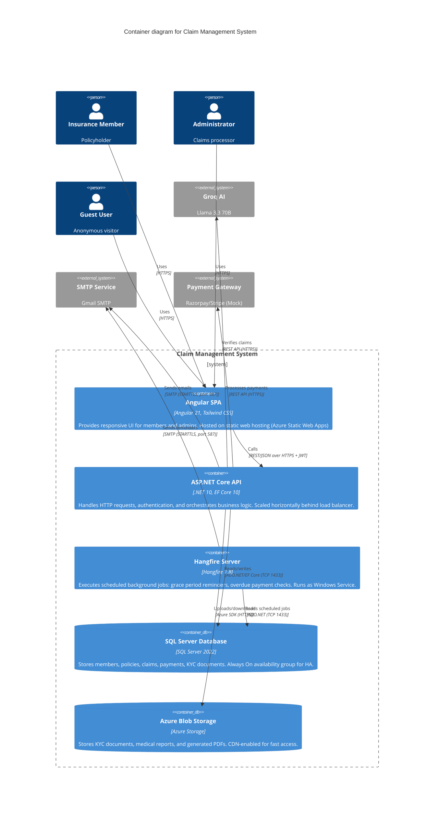

# Container Architecture – C4 Level 2

## Overview

This document decomposes the Claim Management System into **containers** (independently deployable units). Each container represents a runtime process with its own responsibilities.

---

## Container Diagram (Mermaid)



---

## Container Details

### Container 1: Angular SPA (Single Page Application)

**Technology:** Angular 21, Tailwind CSS, Lottie Web  
**Hosting:** Azure Static Web Apps (or any static web server)  
**Build Command:** `ng build --configuration production`  
**Output Directory:** `dist/cms-frontend/`

**Key Features:**

| Feature | Implementation | File Reference |
|---------|---------------|----------------|
| Routing | Standalone components + lazy loading | `admin.routes.ts` lines 12-28 |
| State management | Services with RxJS Subjects | `ClaimService.triggerRefresh()` |
| HTTP calls | HttpClient + interceptors | `jwt.interceptor.ts` lines 16-20 |
| Authentication | JWT stored in localStorage | `AuthService.getToken()` |
| Animations | Lottie + Angular animations | `auth-deck.component.ts` lines 27-44 |

**Environment Configuration:**

| Environment | API Base URL | File |
|-------------|-------------|------|
| Development | `https://localhost:7013/api` | `environment.ts` |
| Production | `https://api.claimcore.com/api` | `environment.prod.ts` |

**Deployment Artifacts:**

```
dist/cms-frontend/
├── index.html
├── main-[hash].js
├── polyfills-[hash].js
├── styles-[hash].css
├── vendor-[hash].js
└── assets/
    ├── lottie/
    └── images/
```

---

### Container 2: ASP.NET Core API

**Technology:** .NET 10, ASP.NET Core, EF Core 10  
**Hosting:** Azure App Service / IIS / Linux containers  
**Startup Class:** `Program.cs` (minimal API style)

**Key Middleware (in order):**

| Order | Middleware | Purpose | File |
|-------|-----------|---------|------|
| 1 | `GlobalExceptionMiddleware` | Catches unhandled exceptions | `GlobalExceptionMiddleware.cs` lines 15-40 |
| 2 | `UseAuthentication` | Validates JWT | Built-in |
| 3 | `UseAuthorization` | Enforces role policies | Built-in |
| 4 | `UseHangfireDashboard` | Background job monitoring | (inferred) |
| 5 | `MapControllers` | Routes to API endpoints | `Program.cs` |

**API Endpoint Categories:**

| Category | Base Route | Authentication | Controllers |
|----------|-----------|---------------|-------------|
| Public | `/api/v1/public` | None | `PublicPlansController` |
| Authentication | `/api/auth` | None | `AuthController` |
| Member | `/api/v1/members` | JWT (Member role) | `MembersController` |
| Claims | `/api/v1/claims` | JWT (Member role) | `ClaimController` |
| Plans | `/api/v1/plans` | JWT (Member role) | `PlanController` |
| KYC | `/api/v1/kyc` | JWT (Member role) | `KycController` |
| Premium | `/api/v1/premium` | Mixed | `PremiumController` |
| Admin | `/api/admin` | JWT (Admin role) | `AdminMembersController`, etc. |
| Test | `/api/test` | None | `TestController` |

**Configuration Sources:**

| Source | Priority | Keys Used |
|--------|----------|----------|
| `appsettings.json` | 1 (default) | `ConnectionStrings`, `Jwt`, `AI`, `EmailSettings` |
| `appsettings.Development.json` | 2 (override) | `Logging` |
| Environment variables | 3 (override) | `ASPNETCORE_ENVIRONMENT` |
| User secrets (development) | 4 (development only) | API keys, passwords |

> **Health Check Endpoint:** (inferred) `GET /health` – returns 200 when database is accessible

---

### Container 3: Hangfire Server

**Technology:** Hangfire 1.8, .NET 10  
**Hosting:** Windows Service / Linux daemon (runs separately from API)  
**Database:** Uses same SQL Server as API (Hangfire tables: `Hangfire.*`)

**Scheduled Jobs Configuration:**

```csharp
RecurringJob.AddOrUpdate<IGracePeriodService>(
    "grace-period-reminders",
    service => service.SendGracePeriodRemindersAsync(CancellationToken.None),
    Cron.Daily(9, 0));  // 9:00 AM daily

RecurringJob.AddOrUpdate<IGracePeriodService>(
    "overdue-payment-check",
    service => service.CheckAndUpdateOverduePaymentsAsync(CancellationToken.None),
    Cron.Hourly());  // Every hour

RecurringJob.AddOrUpdate<IPaymentService>(
    "check-overdue-lapse",
    service => service.CheckOverduePaymentsAndLapsePoliciesAsync(CancellationToken.None),
    Cron.Hourly(15));  // 15 minutes past each hour
```

**Background Job Details:**

| Job Name | Cron Schedule | Purpose | File Reference |
|----------|--------------|---------|----------------|
| `grace-period-reminders` | Daily 9:00 AM | Send payment reminders 7/3/1 days before due | `GracePeriodService.cs` lines 127-166 |
| `overdue-payment-check` | Hourly | Identify overdue payments | `GracePeriodService.cs` lines 24-49 |
| `check-overdue-lapse` | Hourly (:15) | Lapse policies after 30+ days overdue | `PaymentService.cs` lines 106-122 |

> **Monitoring Dashboard:** `/hangfire` (Admin-only access via `[AuthorizeAdmin]`)

---

### Container 4: SQL Server Database

**Technology:** SQL Server 2022  
**Hosting:** Azure SQL Managed Instance / On-premise  
**Connection Pooling:** Enabled (default, max pool size = 100)  
**Database Size:** ~70 MB (excluding blob storage)

**Key Tables:**

| Table | Row Count Estimate | Indexes | Growth Rate |
|-------|-------------------|---------|-------------|
| `Members` | 10,000 | Email (unique), Status | +100/month |
| `Policies` | 10,000 | PolicyNumber (unique), MemberId+Status | +100/month |
| `Claims` | 50,000 | MemberId+Status, CreatedAt | +500/month |
| `PremiumPayments` | 100,000 | DueDate, Status, PolicyId | +1,000/month |
| `KycDocuments` | 30,000 | MemberId, IsVerified | +100/month |

**Backup Strategy:**

| Backup Type | Frequency | Retention |
|-------------|----------|-----------|
| Full backup | Daily | 30 days |
| Differential | Every 6 hours | 7 days |
| Transaction log | Every 15 minutes | 2 days |

> **High Availability:** Always On availability group with 1 secondary replica (synchronous commit)

---

### Container 5: Azure Blob Storage

**Technology:** Azure Blob Storage (hot tier)  
**Hosting:** Azure Storage Account

**Container Structure:**

```
claimcore-documents/
├── kyc/
│   └── {memberId}/
│       ├── {documentId}_{documentType}_{timestamp}.pdf
│       └── {documentId}_{documentType}_{timestamp}.jpg
├── claims/
│   └── {claimId}/
│       ├── medical_report_{timestamp}.pdf
│       └── settlement_letter_{timestamp}.pdf
├── receipts/
│   └── {paymentId}_{timestamp}.pdf
└── policies/
    └── {policyId}_certificate_{timestamp}.pdf
```

- **Access Control:** SAS (Shared Access Signatures) with 1-hour expiry for temporary URLs
- **CDN Integration:** Azure CDN for public assets (policy PDFs, receipts)

**File Size Limits:**

| Document Type | Max Size | Enforced In |
|--------------|----------|-------------|
| KYC documents | 5 MB | `KycController.cs` lines 29-31 |
| Medical reports | 10 MB | `ClaimService.cs` lines 66-68 |
| Generated PDFs | 2 MB | N/A (auto) |

---

## Inter-Container Communication

### Synchronous Communication (Request-Response)

| Source → Target | Protocol | Data Format | Timeout |
|----------------|---------|------------|---------|
| SPA → API | HTTPS | JSON | 30 seconds |
| API → Groq AI | HTTPS | JSON | 45 seconds |
| API → Payment Gateway | HTTPS | JSON | 10 seconds |
| API → SQL Server | TCP (1433) | TDS | 120 seconds |

### Asynchronous Communication (Fire-and-Forget)

| Source → Target | Mechanism | Retry Policy |
|----------------|----------|-------------|
| API → Hangfire | SQL Server queue | Built-in (3 retries) |
| Hangfire → Email | SMTP | Manual retry (2 minutes) |
| API → Blob Storage | Azure SDK | 3 retries (exponential backoff) |

---

## Deployment Topology (Physical Architecture)

```mermaid
graph TB
    subgraph "Load Balancer / Reverse Proxy"
        LB[nginx / Azure Front Door]
    end

    subgraph "Application Layer"
        API1[CMS.API Instance 1]
        API2[CMS.API Instance 2]
        API3[CMS.API Instance n]
    end

    subgraph "Background Processing"
        HF[Hangfire Server]
    end

    subgraph "Data Layer"
        DB[(SQL Server Always On)]
        BLOB[(Azure Blob Storage)]
    end

    subgraph "External Services"
        GROQ[Groq AI]
        SMTP[Gmail SMTP]
        PG[Payment Gateway]
    end

    LB --> API1
    LB --> API2
    LB --> API3

    API1 --> DB
    API2 --> DB
    API3 --> DB
    API1 --> BLOB
    API2 --> BLOB

    HF --> DB
    HF --> SMTP

    API1 --> GROQ
    API2 --> GROQ
    API1 --> PG

    style LB fill:#3B82F6
    style API1 fill:#1E3A8A
    style API2 fill:#1E3A8A
    style API3 fill:#1E3A8A
    style HF fill:#0F172A
    style DB fill:#0F172A
```



---

## Deployment Commands

### Build Angular SPA

```bash
cd src/frontend
npm install
ng build --configuration production
# Output: dist/cms-frontend/
```

### Build .NET API

```bash
cd src/backend/CMS.API
dotnet publish -c Release -o ./publish
# Output: ./publish/CMS.API.dll
```

### Run Hangfire Server (Windows Service)

```bash
# Install as Windows Service
sc.exe create "CMS Hangfire" binPath="C:\cms\hangfire\HangfireServer.exe"

# Start service
net start "CMS Hangfire"
```

### Run Hangfire Server (Linux daemon)

```bash
# Create systemd service file
sudo nano /etc/systemd/system/cms-hangfire.service

# Start and enable
sudo systemctl start cms-hangfire
sudo systemctl enable cms-hangfire
```

---

## Environment Variables (Production)

| Variable | Purpose | Source Container |
|----------|---------|-----------------|
| `ASPNETCORE_ENVIRONMENT` | Environment name (Production) | API |
| `ConnectionStrings__CmsDatabase` | SQL Server connection string | API, Hangfire |
| `Jwt__SecretKey` | JWT signing key | API |
| `AI__ApiKey` | Groq API key | API |
| `EmailSettings__Password` | Gmail app password | API, Hangfire |
| `AzureStorage__ConnectionString` | Blob storage key | API |

---

## Security Groups and Firewall Rules

| Source | Destination | Port | Protocol | Purpose |
|--------|------------|------|---------|---------|
| Load Balancer | API Instances | 443 | HTTPS | User traffic |
| API Instances | SQL Server | 1433 | TCP | Database queries |
| API Instances | Groq API | 443 | HTTPS | AI verification |
| API Instances | Blob Storage | 443 | HTTPS | Document storage |
| Hangfire Server | SQL Server | 1433 | TCP | Job persistence |
| Hangfire Server | SMTP (Gmail) | 587 | SMTP | Email sending |
| Any (user) | SPA (CDN) | 443 | HTTPS | Static assets |

---

## Scaling Configuration

| Container | Instance Count | Scale Trigger | Scale Limit |
|-----------|--------------|--------------|------------|
| Angular SPA | 1 (CDN) | N/A (static) | Unlimited (CDN) |
| CMS.API | 3 (default) | CPU > 70% for 5 min | 10 instances |
| Hangfire Server | 1 | N/A (singleton) | 1 (requires distributed lock) |
| SQL Server | 1 primary + 1 replica | Read replica for reporting | 5 replicas |
| Blob Storage | 1 | N/A (native scaling) | Unlimited |

---

## Monitoring and Observability

| Metric | Collection Tool | Dashboard |
|--------|---------------|-----------|
| API response time | Application Insights | Azure Portal |
| Error rate | Serilog + Application Insights | Azure Portal |
| Hangfire job duration | Hangfire Dashboard | `/hangfire` |
| SQL Server performance | Azure SQL Analytics | Azure Portal |
| Blob storage metrics | Azure Storage Analytics | Azure Portal |

**Critical Alerts:**

| Condition | Threshold | Action |
|-----------|----------|--------|
| API error rate > 5% | 5 minutes | PagerDuty alert |
| Hangfire job queue > 100 | 10 minutes | Email to admin |
| SQL Server DTU > 80% | 15 minutes | Auto-scale (if enabled) |
| Claim submission failure | Immediate | Retry with exponential backoff |

---

## Disaster Recovery

| Scenario | RPO | RTO | Strategy |
|----------|-----|-----|----------|
| Database corruption | 15 minutes | 4 hours | Point-in-time restore |
| Region failure | 1 hour | 8 hours | Geo-redundant storage (GRS) |
| API crash | 0 (stateless) | 5 minutes | Load balancer + health probes |
| Blob storage outage | 0 (immutable) | 30 minutes | CDN + local cache |
| AI service outage | N/A | N/A | Mock mode fallback |

---

## Technology Stack Summary

| Container | Technology | Version | Port | Scaling |
|-----------|-----------|---------|------|---------|
| Angular SPA | Angular + Tailwind | 21 / 3.4 | 443 (CDN) | CDN (static) |
| ASP.NET Core API | .NET 10 + EF Core 10 | 10.0.8 | 443 | Horizontal (3+ instances) |
| Hangfire Server | Hangfire + SQL Server | 1.8.23 | N/A | Singleton (1 instance) |
| SQL Server | SQL Server 2022 | 2022 | 1433 | Vertical (read replicas) |
| Azure Blob | Azure Storage | N/A | 443 | Native (unlimited) |
| Groq AI | Llama 3.3 70B | N/A | 443 | External (limited) |
| SMTP | Gmail SMTP | N/A | 587 | External (limited) |

---

## References

- C4 Model: <https://c4model.com/>
- Azure Static Web Apps: <https://azure.microsoft.com/en-us/products/app-service/static>
- Azure SQL Managed Instance: <https://azure.microsoft.com/en-us/products/azure-sql/managed-instance>
- Hangfire Documentation: <https://www.hangfire.io/>
- .NET 10 Deployment: <https://learn.microsoft.com/en-us/dotnet/core/deploying/>