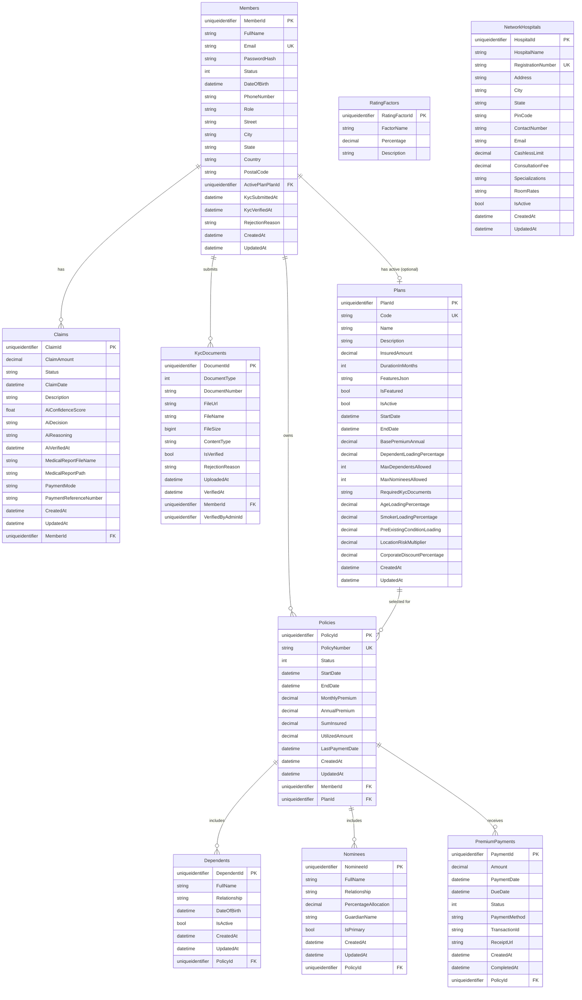

# Database Schema & Entity Relationship Diagram

## Overview

The application uses **Microsoft SQL Server** as the relational database. The schema is designed to support the domain aggregates defined in `CMS.Domain.Entities`.

**Connection String:** `src/backend/CMS.API/appsettings.json`

```json
"ConnectionStrings": {
    "CmsDatabase": "Server=;Database=ClaimManagementDB;User Id=;Password=;TrustServerCertificate=True;MultipleActiveResultSets=true"
}
```

---

## Complete Entity Relationship Diagram (Mermaid)



---

## Table Details

### 1. Members Table

Stores user accounts (policyholders).

| Column | Type | Nullable | Description |
|--------|------|----------|-------------|
| MemberId | uniqueidentifier | NO | Primary key |
| FullName | nvarchar(200) | NO | Member's full name |
| Email | nvarchar(200) | NO | Unique email (login credential) |
| PasswordHash | nvarchar(500) | NO | BCrypt hash |
| Status | int | NO | 0=Pending, 1=Verified, 2=Rejected, 3=Suspended |
| DateOfBirth | datetime2 | NO | Member's date of birth |
| PhoneNumber | nvarchar(20) | YES | Mobile number for OTP |
| Role | nvarchar(50) | NO | "Member", "Admin", "ClaimsProcessor" |
| Street | nvarchar(200) | NO | From Address value object |
| City | nvarchar(100) | NO | From Address value object |
| State | nvarchar(100) | NO | From Address value object |
| Country | nvarchar(100) | NO | From Address value object |
| PostalCode | nvarchar(20) | NO | From Address value object |
| ActivePlanPlanId | uniqueidentifier | YES | FK to Plans (legacy, nullable) |
| KycSubmittedAt | datetime2 | YES | Timestamp of first KYC submission |
| KycVerifiedAt | datetime2 | YES | Timestamp of KYC approval |
| RejectionReason | nvarchar(500) | YES | Reason if Status = Rejected |
| CreatedAt | datetime2 | NO | Audit timestamp |
| UpdatedAt | datetime2 | YES | Audit timestamp |

**Indexes:**

```sql
CREATE UNIQUE INDEX IX_Members_Email ON Members(Email);
CREATE INDEX IX_Members_Status ON Members(Status);
```

---

### 2. Plans Table

Defines insurance products available for purchase.

| Column | Type | Nullable | Description |
|--------|------|----------|-------------|
| PlanId | uniqueidentifier | NO | Primary key |
| Code | nvarchar(20) | NO | Unique plan code (e.g., "HEALTH_GOLD") |
| Name | nvarchar(200) | NO | Display name |
| Description | nvarchar(1000) | NO | Marketing description |
| InsuredAmount | decimal(18,2) | NO | Maximum coverage amount |
| DurationInMonths | int | NO | Policy duration (12, 24, 36 months) |
| FeaturesJson | nvarchar(max) | NO | JSON array of feature strings |
| IsFeatured | bit | NO | Show on landing page |
| IsActive | bit | NO | Available for purchase |
| StartDate | datetime2 | NO | Plan effective from |
| EndDate | datetime2 | NO | Plan expires after |
| BasePremiumAnnual | decimal(18,2) | NO | Base annual premium before loadings |
| DependentLoadingPercentage | decimal(5,2) | NO | Additional % per dependent |
| MaxDependentsAllowed | int | NO | Maximum dependents per policy |
| MaxNomineesAllowed | int | NO | Maximum nominees per policy |
| RequiredKycDocuments | nvarchar(max) | NO | JSON array of required document types |
| AgeLoadingPercentage | decimal(18,2) | YES | Loading for age > 60 |
| SmokerLoadingPercentage | decimal(18,2) | YES | Loading for smokers |
| PreExistingConditionLoading | decimal(18,2) | YES | Loading for pre-existing conditions |
| LocationRiskMultiplier | decimal(18,2) | YES | Multiplier based on pin code |
| CorporateDiscountPercentage | decimal(18,2) | YES | Discount for corporate codes |
| CreatedAt | datetime2 | NO | Audit timestamp |
| UpdatedAt | datetime2 | YES | Audit timestamp |

**Indexes:**

```sql
CREATE UNIQUE INDEX IX_Plans_Code ON Plans(Code);
CREATE INDEX IX_Plans_IsActive ON Plans(IsActive);
```

---

### 3. Policies Table

Active insurance contracts issued to members.

| Column | Type | Nullable | Description |
|--------|------|----------|-------------|
| PolicyId | uniqueidentifier | NO | Primary key |
| PolicyNumber | nvarchar(50) | NO | Unique human-readable number (e.g., "POL-20260101-ABC123") |
| Status | int | NO | 0=Active, 1=Lapsed, 2=Cancelled, 3=Expired |
| StartDate | datetime2 | NO | Policy effective date |
| EndDate | datetime2 | NO | Policy expiry date |
| MonthlyPremium | decimal(18,2) | NO | Monthly premium amount |
| AnnualPremium | decimal(18,2) | NO | Annual premium amount |
| SumInsured | decimal(18,2) | NO | Total coverage amount |
| UtilizedAmount | decimal(18,2) | YES | Total claimed amount so far (default 0) |
| LastPaymentDate | datetime2 | YES | Most recent premium payment date |
| CreatedAt | datetime2 | NO | Audit timestamp |
| UpdatedAt | datetime2 | YES | Audit timestamp |
| MemberId | uniqueidentifier | NO | FK to Members |
| PlanId | uniqueidentifier | NO | FK to Plans |

**Indexes:**

```sql
CREATE UNIQUE INDEX IX_Policies_PolicyNumber ON Policies(PolicyNumber);
CREATE INDEX IX_Policies_MemberId_Status ON Policies(MemberId, Status);
```

---

### 4. Claims Table

Health insurance claims submitted by members.

| Column | Type | Nullable | Description |
|--------|------|----------|-------------|
| ClaimId | uniqueidentifier | NO | Primary key |
| ClaimAmount | decimal(18,2) | NO | Requested amount |
| Status | nvarchar(50) | NO | Submitted, Approved, Rejected, Pending, Paid |
| ClaimDate | datetime2 | NO | Date of medical service |
| Description | nvarchar(500) | YES | Claim details |
| AiConfidenceScore | decimal(5,2) | YES | 0–100 score from AI verification |
| AiDecision | nvarchar(50) | YES | Approved, Rejected, ManualReview |
| AiReasoning | nvarchar(1000) | YES | AI explanation |
| AiVerifiedAt | datetime2 | YES | Timestamp of AI check |
| MedicalReportFileName | nvarchar(500) | YES | Uploaded file name |
| MedicalReportPath | nvarchar(1000) | YES | File storage path |
| PaymentMode | nvarchar(50) | YES | NEFT, IMPS, CHEQUE |
| PaymentReferenceNumber | nvarchar(100) | YES | Reference for settled claim |
| CreatedAt | datetime2 | NO | Audit timestamp |
| UpdatedAt | datetime2 | YES | Audit timestamp |
| MemberId | uniqueidentifier | NO | FK to Members |

**Indexes:**

```sql
CREATE INDEX IX_Claims_MemberId_Status ON Claims(MemberId, Status);
CREATE INDEX IX_Claims_CreatedAt ON Claims(CreatedAt);
```

---

### 5. Dependents Table

Family members covered under a policy.

| Column | Type | Nullable | Description |
|--------|------|----------|-------------|
| DependentId | uniqueidentifier | NO | Primary key |
| FullName | nvarchar(200) | NO | Dependent's full name |
| Relationship | nvarchar(50) | NO | Spouse, Child, Parent |
| DateOfBirth | datetime2 | NO | For age calculation |
| IsActive | bit | NO | Soft delete flag |
| CreatedAt | datetime2 | NO | Audit timestamp |
| UpdatedAt | datetime2 | YES | Audit timestamp |
| PolicyId | uniqueidentifier | NO | FK to Policies |

**Indexes:**

```sql
CREATE INDEX IX_Dependents_PolicyId ON Dependents(PolicyId);
```

---

### 6. Nominees Table

Beneficiaries who receive claim payouts.

| Column | Type | Nullable | Description |
|--------|------|----------|-------------|
| NomineeId | uniqueidentifier | NO | Primary key |
| FullName | nvarchar(200) | NO | Nominee's full name |
| Relationship | nvarchar(50) | NO | Spouse, Child, Parent |
| PercentageAllocation | decimal(5,2) | NO | Percentage of claim amount (sum to 100) |
| GuardianName | nvarchar(200) | YES | For minor nominees |
| IsPrimary | bit | NO | Primary nominee gets first preference |
| CreatedAt | datetime2 | NO | Audit timestamp |
| UpdatedAt | datetime2 | YES | Audit timestamp |
| PolicyId | uniqueidentifier | NO | FK to Policies |

**Indexes:**

```sql
CREATE INDEX IX_Nominees_PolicyId ON Nominees(PolicyId);
```

---

### 7. PremiumPayments Table

Premium payment history.

| Column | Type | Nullable | Description |
|--------|------|----------|-------------|
| PaymentId | uniqueidentifier | NO | Primary key |
| Amount | decimal(18,2) | NO | Payment amount |
| PaymentDate | datetime2 | NO | Date payment was made |
| DueDate | datetime2 | NO | Premium due date |
| Status | int | NO | 0=Pending, 1=Completed, 2=Failed, 3=Refunded |
| PaymentMethod | nvarchar(50) | YES | Credit Card, UPI, Net Banking |
| TransactionId | nvarchar(100) | YES | Gateway transaction ID |
| ReceiptUrl | nvarchar(500) | YES | Path to PDF receipt |
| CreatedAt | datetime2 | NO | Audit timestamp |
| CompletedAt | datetime2 | YES | Timestamp when payment completed |
| PolicyId | uniqueidentifier | NO | FK to Policies |

**Indexes:**

```sql
CREATE INDEX IX_PremiumPayments_DueDate ON PremiumPayments(DueDate);
CREATE INDEX IX_PremiumPayments_Status ON PremiumPayments(Status);
CREATE INDEX IX_PremiumPayments_PolicyId ON PremiumPayments(PolicyId);
```

---

### 8. KycDocuments Table

KYC verification documents.

| Column | Type | Nullable | Description |
|--------|------|----------|-------------|
| DocumentId | uniqueidentifier | NO | Primary key |
| DocumentType | int | NO | 0=Aadhaar, 1=PAN, 2=Passport, 3=DrivingLicense |
| DocumentNumber | nvarchar(100) | NO | Document ID number |
| FileUrl | nvarchar(500) | NO | Storage path |
| FileName | nvarchar(200) | NO | Original file name |
| FileSize | bigint | NO | Size in bytes |
| ContentType | nvarchar(100) | YES | MIME type |
| IsVerified | bit | NO | Admin verification status |
| RejectionReason | nvarchar(500) | YES | Reason if rejected |
| UploadedAt | datetime2 | NO | Timestamp of upload |
| VerifiedAt | datetime2 | YES | Timestamp of admin action |
| MemberId | uniqueidentifier | NO | FK to Members |
| VerifiedByAdminId | uniqueidentifier | YES | Admin who verified |

**Indexes:**

```sql
CREATE INDEX IX_KycDocuments_MemberId ON KycDocuments(MemberId);
CREATE INDEX IX_KycDocuments_IsVerified ON KycDocuments(IsVerified);
```

---

### 9. NetworkHospitals Table

Cashless hospital network.

| Column | Type | Nullable | Description |
|--------|------|----------|-------------|
| HospitalId | uniqueidentifier | NO | Primary key |
| HospitalName | nvarchar(200) | NO | Hospital name |
| RegistrationNumber | nvarchar(100) | NO | Government registration number |
| Address | nvarchar(500) | YES | Full address |
| City | nvarchar(100) | NO | City for search |
| State | nvarchar(100) | NO | State |
| PinCode | nvarchar(10) | NO | Postal code |
| ContactNumber | nvarchar(20) | YES | Phone number |
| Email | nvarchar(200) | YES | Contact email |
| CashlessLimit | decimal(18,2) | YES | Maximum cashless limit |
| ConsultationFee | decimal(18,2) | YES | Initial consultation fee |
| Specializations | nvarchar(max) | YES | Comma-separated list |
| RoomRates | nvarchar(max) | YES | JSON dictionary of room types to rates |
| IsActive | bit | NO | Active in network |
| CreatedAt | datetime2 | NO | Audit timestamp |
| UpdatedAt | datetime2 | YES | Audit timestamp |

**Indexes:**

```sql
CREATE UNIQUE INDEX IX_NetworkHospitals_RegistrationNumber ON NetworkHospitals(RegistrationNumber);
CREATE INDEX IX_NetworkHospitals_City_IsActive ON NetworkHospitals(City, IsActive);
```

---

### 10. RatingFactors Table (Lookup)

Premium calculation factors.

| Column | Type | Nullable | Description |
|--------|------|----------|-------------|
| RatingFactorId | uniqueidentifier | NO | Primary key |
| FactorName | nvarchar(100) | NO | e.g., "AgeLoading", "SmokerLoading" |
| Percentage | decimal(18,2) | NO | Factor percentage |
| Description | nvarchar(500) | YES | Explanation |

---

## Foreign Key Relationships Summary

| Constraint | From Table | To Table | Delete Behavior |
|------------|------------|----------|-----------------|
| FK_Claims_Members | Claims.MemberId | Members.MemberId | RESTRICT |
| FK_Policies_Members | Policies.MemberId | Members.MemberId | RESTRICT |
| FK_Policies_Plans | Policies.PlanId | Plans.PlanId | RESTRICT |
| FK_Dependents_Policies | Dependents.PolicyId | Policies.PolicyId | CASCADE |
| FK_Nominees_Policies | Nominees.PolicyId | Policies.PolicyId | CASCADE |
| FK_PremiumPayments_Policies | PremiumPayments.PolicyId | Policies.PolicyId | CASCADE |
| FK_KycDocuments_Members | KycDocuments.MemberId | Members.MemberId | CASCADE |
| FK_Members_Plans | Members.ActivePlanPlanId | Plans.PlanId | RESTRICT |

---

## Data Types by Category

| Category | SQL Type | .NET Type |
|----------|----------|-----------|
| Primary Keys | uniqueidentifier | Guid |
| Text (short) | nvarchar(50–200) | string |
| Text (long) | nvarchar(max) | string (JSON) |
| Currency | decimal(18,2) | decimal |
| Percentages | decimal(5,2) | decimal |
| Dates | datetime2 | DateTime |
| Flags | bit | bool |
| Enums | int or nvarchar | enum |

---

## Sample Queries

**Get Member with Active Policy**

```sql
SELECT m.FullName, m.Email, p.PolicyNumber, p.SumInsured, p.EndDate
FROM Members m
LEFT JOIN Policies p ON m.MemberId = p.MemberId AND p.Status = 0
WHERE m.MemberId = @MemberId;
```

**Get Claim with AI Verification Details**

```sql
SELECT c.ClaimId, c.ClaimAmount, c.Status, c.AiConfidenceScore, c.AiDecision
FROM Claims c
WHERE c.MemberId = @MemberId
ORDER BY c.CreatedAt DESC;
```

**Get Pending KYC Documents**

```sql
SELECT k.DocumentId, k.DocumentType, k.DocumentNumber, m.FullName, m.Email
FROM KycDocuments k
INNER JOIN Members m ON k.MemberId = m.MemberId
WHERE k.IsVerified = 0 AND k.RejectionReason IS NULL;
```

---

## Database Size Estimates

| Table | Estimated Row Count | Size per Row | Estimated Size |
|-------|---------------------|--------------|----------------|
| Members | 10,000 | ~500 bytes | 5 MB |
| Plans | 50 | ~400 bytes | 20 KB |
| Policies | 10,000 | ~300 bytes | 3 MB |
| Claims | 50,000 | ~400 bytes | 20 MB |
| Dependents | 20,000 | ~200 bytes | 4 MB |
| Nominees | 20,000 | ~250 bytes | 5 MB |
| PremiumPayments | 100,000 | ~200 bytes | 20 MB |
| KycDocuments | 30,000 | ~300 bytes | 9 MB |
| NetworkHospitals | 500 | ~800 bytes | 400 KB |

> **Total estimated size:** ~70 MB (excluding file storage for documents)