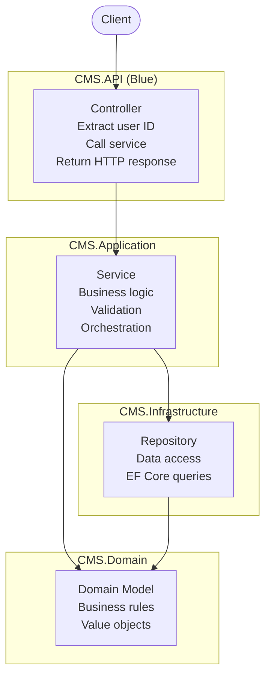

# ADR-002: Thin Controllers Pattern

## Status

**ACCEPTED** – Applied to all API controllers

---

## Context

The API layer (`CMS.API`) needs to handle HTTP requests and responses. Design options for controller responsibilities:

| Pattern | Description | Controller Responsibility |
|---------|-------------|--------------------------|
| **Fat Controller** | Business logic inside controller | Authentication, validation, orchestration, data access |
| **Thin Controller** | Business logic delegated to services | Extract user ID, call service, return HTTP response |
| **Mediator Pattern** | Commands/Queries sent to handlers | Dispatch to handler, return response |

**Key requirements:**

- Testability (unit tests without HTTP context)
- Separation of concerns
- Reusability of business logic
- Clear responsibility boundaries
- Maintainability for internship training

---

## Decision

**Implement Thin Controllers** – Controllers delegate all business logic to Application Services.

**Evidence files:**

- `src/backend/CMS.API/Controllers/AuthController.cs` (38 lines, no business logic)
- `src/backend/CMS.API/Controllers/MemberController.cs` (56 lines, no business logic)
- `src/backend/CMS.API/Controllers/PlanController.cs` (48 lines, no business logic)

---

## Reasons

### 1. Testability Without HTTP Context

Business logic in services can be unit tested without mocking `HttpContext`, `Request`, or `Response`.

**Example unit test:**

**File:** `src/backend/CMS.Tests/ClaimServiceTests.cs` lines 16-29

```csharp
[Fact]
public async Task SubmitClaim_ShouldThrow_When_NoActivePlan()
{
    // Arrange – no HTTP context needed
    var memberRepo = Substitute.For<IMemberRepository>();
    memberRepo.GetByIdAsync(Arg.Any<Guid>(), Arg.Any<CancellationToken>())
        .Returns((Member?)null);

    var service = new ClaimService(memberRepo, ...);

    // Act & Assert
    await Assert.ThrowsAsync<InvalidOperationException>(() =>
        service.SubmitClaimAsync(Guid.NewGuid(), new SubmitClaimRequest(), CancellationToken.None));
}
```

> **If business logic were in controller:** Would need to mock `HttpContext.User`, `RequestAborted`, and response objects – significantly more complex.

---

### 2. Separation of Concerns

Each layer has clear responsibility:

| Layer | Responsibility | File Example |
|-------|---------------|--------------|
| Controller | HTTP parsing, authentication extraction, response formatting | `AuthController.cs` lines 19-27 |
| Service | Business logic, validation, orchestration | `AuthService.cs` lines 41-93 |
| Repository | Data access | `MemberRepository.cs` lines 17-23 |
| Domain | Business rules | `Member.cs` (inferred) |

---

### 3. Reusability Across Endpoints

The same service method can be called from different controllers or background jobs.

**Example – `IClaimService.SubmitClaimAsync` used in:**

- `ClaimController.SubmitClaim` (HTTP POST)
- Scheduled job for bulk claim import (not yet implemented)
- Admin dashboard for claim creation (not yet implemented)

> **If logic were in controller:** Reuse would require copy-paste or inheritance.

---

### 4. Simplified Controller Code

Controllers remain under 60 lines, focusing only on:

- Extract `memberId` from JWT claims
- Call service method
- Return HTTP response (200, 400, 404)

**Example – MembersController:**

**File:** `src/backend/CMS.API/Controllers/MemberController.cs` lines 24-35

```csharp
[HttpGet("me")]
public async Task<ActionResult<MemberDashboardResponse>> GetMyDetails()
{
    var memberId = Guid.Parse(User.FindFirstValue(ClaimTypes.NameIdentifier)!);
    var result = await _memberService.GetMyDashboardAsync(memberId, HttpContext.RequestAborted);
    return Ok(result);
}
```

> **No business logic present:** No validation of `memberId`, no database queries, no error handling beyond service exceptions.

---

### 5. Consistent Error Handling

Global exception middleware catches all service exceptions and returns consistent HTTP responses.

**File:** `src/backend/CMS.API/Middleware/GlobalExceptionMiddleware.cs` lines 15-40

```csharp
catch (InvalidOperationException ex)
{
    context.Response.StatusCode = (int)HttpStatusCode.BadRequest;
    await context.Response.WriteAsync(JsonSerializer.Serialize(new { error = ex.Message }));
}
```

> **Benefit:** Controllers don't need `try-catch` blocks for business exceptions.

---

### 6. Dependency Injection Alignment

Services are registered as `Scoped` and injected into controllers.

**File:** `src/backend/CMS.Application/DependencyInjection.cs` lines 12-31

```csharp
services.AddScoped<IMemberService, MemberService>();
services.AddScoped<IClaimService, ClaimService>();
```

Controllers receive fully constructed service graphs via constructor injection.

---

## Consequences

### Positive

| Consequence | Evidence |
|-------------|----------|
| Controllers are thin (<60 lines) | `AuthController.cs` – 38 lines |
| Services are testable without HTTP | `ClaimServiceTests.cs` – 29 lines |
| Business logic reusable | Same service called by multiple controllers |
| Clear responsibility boundaries | Each layer has single purpose |
| Easy onboarding for interns | Controllers are simple to understand |

### Negative

| Consequence | Mitigation |
|-------------|------------|
| More classes (separate controller + service) | Acceptable – clear separation worth cost |
| Slight performance overhead (extra method call) | Negligible (microseconds) |
| Requires discipline to avoid logic in controllers | Code review enforces pattern |

---

## Trade-offs

| Alternative | Why Rejected |
|-------------|--------------|
| Fat Controllers | Untestable, unreusable, violates Single Responsibility Principle |
| Mediator Pattern (MediatR) | Overkill for this scale. Adds complexity without clear benefit for internship training. |
| Minimal APIs | No built-in support for filters, model binding less feature-rich. Controllers are more familiar to team. |

---

## Code Evidence – Controller Responsibility Audit

### AuthController – Authentication Only

**File:** `src/backend/CMS.API/Controllers/AuthController.cs`

| Line(s) | Operation | Business Logic? |
|---------|-----------|-----------------|
| 19-27 | `Register()` – calls `IAuthService.RegisterAsync` | ❌ No |
| 29-37 | `Login()` – calls `IAuthService.LoginAsync` | ❌ No |

> **Business logic location:** `AuthService.cs` lines 41-93 (registration flow with policy creation)

---

### MembersController – Member Operations Only

**File:** `src/backend/CMS.API/Controllers/MemberController.cs`

| Line(s) | Operation | Business Logic? |
|---------|-----------|-----------------|
| 24-35 | `GetMyDetails()` – calls `IMemberService.GetMyDashboardAsync` | ❌ No |
| 40-56 | `UpdateProfile()` – calls `IMemberService.UpdateProfileAsync` | ❌ No |

> **Business logic location:** `MemberService.cs` lines 57-71 (address validation, phone update)

---

### PlanController – Plan Assignment Only

**File:** `src/backend/CMS.API/Controllers/PlanController.cs`

| Line(s) | Operation | Business Logic? |
|---------|-----------|-----------------|
| 36-47 | `AssignPlan()` – calls `IMemberService.AssignPlanAsync` | ❌ No |
| 22-33 | `UpdateMyPlan()` – calls `IMemberService.UpdateActivePlanAsync` | ❌ No |

> **Business logic location:** `MemberService.cs` lines 45-55 (plan validation, update logic)

---

### KycController – Document Upload Only

**File:** `src/backend/CMS.API/Controllers/KycController.cs`

| Line(s) | Operation | Business Logic? |
|---------|-----------|-----------------|
| 21-48 | `UploadKycDocument()` – validates file, calls service | ❌ No (validation only) |
| 50-58 | `GetKycStatus()` – calls `IKycService.GetKycStatusAsync` | ❌ No |

> **Note:** File size validation (line 29-31) is HTTP-specific – acceptable in controller.

---

### Exception – Controller Validation

Controllers may perform HTTP-specific validation:

**File:** `src/backend/CMS.API/Controllers/KycController.cs` lines 26-31

```csharp
if (file == null || file.Length == 0)
    return BadRequest(new { error = "File is required" });

if (file.Length > 5 * 1024 * 1024)
    return BadRequest(new { error = "File size cannot exceed 5MB" });
```

This is acceptable because:

- File upload is an HTTP-specific concern
- Service layer should not depend on `IFormFile`
- Returns `400 Bad Request` immediately without calling service

> **Rule of thumb:** If validation is HTTP-specific (file upload, content-type, header values), keep in controller. If validation is a business rule (amount > 0, date within policy period), put in service.

---

## Violations to Avoid

### ❌ Anti-Pattern – Business Logic in Controller

```csharp
// DO NOT DO THIS
[HttpPost("assign")]
public async Task<IActionResult> AssignPlan(AssignPlanRequest request)
{
    var member = await _memberRepository.GetByIdAsync(memberId);

    if (member.ActivePlan != null)
        return BadRequest("Member already has a plan");  // Business logic in controller!

    var plan = await _planRepository.GetByIdAsync(request.PlanId);
    member.AssignPlan(plan);
    await _memberRepository.UpdateAsync(member);

    return Ok();
}
```

### ✅ Correct – Delegate to Service

```csharp
// DO THIS INSTEAD
[HttpPost("assign")]
public async Task<IActionResult> AssignPlan(AssignPlanRequest request)
{
    var memberId = Guid.Parse(User.FindFirstValue(ClaimTypes.NameIdentifier)!);
    await _memberService.AssignPlanAsync(memberId, request, HttpContext.RequestAborted);
    return Ok(new { message = "Plan assigned successfully" });
}
```

---

## Architecture Diagram



> **Note:** Controllers only talk to Services — they have no direct arrows to Repositories or Domain.

---

## Related Decisions

- ADR-001: EF Core as ORM (services abstract repositories)
- Repository Pattern (services depend on interfaces, not `DbContext`)
- Dependency Injection (services injected into controllers)

---

## Notes

- All 8+ controllers follow this pattern (audited via `CMS.API/Controllers/`)
- Total controller code < 500 lines across all controllers
- Services contain ~3000 lines of business logic