# Angular Frontend Architecture

## Overview

The frontend is built with **Angular 21** using **standalone components** (no NgModules). Key characteristics:

- Lazy-loaded routes for feature modules
- Reactive Forms for complex validations
- Tailwind CSS for styling
- Standalone components for better tree-shaking

**File:** `src/frontend/package.json`

```json
"dependencies": {
    "@angular/animations": "^21.2.11",
    "@angular/common": "^21.1.0",
    "@angular/compiler": "^21.1.0",
    "@angular/core": "^21.1.0",
    "@angular/forms": "^21.1.0",
    "@angular/router": "^21.1.0"
}
```

---

## Project Structure

```
src/frontend/
├── src/
│   ├── app/
│   │   ├── app.ts                 # Root component (standalone)
│   │   ├── app.config.ts          # App-wide providers
│   │   ├── app.routes.ts          # Route configuration
│   │   ├── app.scss               # Global styles
│   │   ├── claims/                # Claim feature module
│   │   │   ├── submit-claim/      # Submit claim component
│   │   │   └── models/            # Claim interfaces
│   │   ├── plan/                  # Plan management
│   │   ├── member/                # Member profile
│   │   ├── admin/                 # Admin feature (lazy-loaded)
│   │   │   ├── admin.routes.ts    # Admin child routes
│   │   │   ├── gaurds/            # Admin guard
│   │   │   └── claims/            # Admin claims management
│   │   ├── auth/                  # Authentication
│   │   ├── guards/                # Route guards
│   │   ├── interceptors/          # HTTP interceptors
│   │   ├── services/              # API services
│   │   ├── models/                # Shared interfaces
│   │   ├── layout/                # Layout components
│   │   ├── components/            # Reusable components
│   │   └── pages/                 # Page components
│   ├── environments/              # Environment configs
│   ├── assets/                    # Images, icons, Lottie files
│   ├── styles.scss                # Global styles entry
│   ├── _variables.scss            # Sass variables
│   └── main.ts                    # Bootstrap entry point
├── public/                        # Static assets
├── tailwind.config.js             # Tailwind CSS config
└── package.json
```

---

## Root Component

**File:** `src/frontend/src/app/app.ts`

```typescript
import { CommonModule } from '@angular/common';
import { Component, signal } from '@angular/core';
import { RouterOutlet } from '@angular/router';

@Component({
  selector: 'app-root',
  standalone: true,
  imports: [CommonModule, RouterOutlet],
  templateUrl: './app.html',
  styleUrl: './app.scss',
})
export class App {
  protected readonly title = signal('cms-frontend');
}
```

**Template:** `src/frontend/src/app/app.html`

```html
<router-outlet></router-outlet>
```

> Key Pattern: Component uses `signal()` for reactive state (Angular 16+ feature).

---

## Bootstrap Configuration

**File:** `src/frontend/src/main.ts`

```typescript
import { bootstrapApplication } from '@angular/platform-browser';
import { provideHttpClient, withInterceptors } from '@angular/common/http';
import { provideRouter } from '@angular/router';
import { provideAnimations } from '@angular/platform-browser/animations';

import { jwtInterceptor } from './app/interceptors/jwt.interceptor';
import { routes } from './app/app.routes';
import { App } from './app/app';
import { httpErrorInterceptor } from './app/interceptors/http-error.interceptor';

bootstrapApplication(App, {
  providers: [
    provideHttpClient(
      withInterceptors([jwtInterceptor, httpErrorInterceptor])
    ),
    provideRouter(routes),
    provideAnimations(),
  ]
}).catch(err => console.error(err));
```

| Provider | Purpose |
|---|---|
| `provideHttpClient` | HTTP client with functional interceptors |
| `provideRouter` | Route configuration |
| `provideAnimations` | Angular animations (used for auth deck transitions) |

---

## Route Configuration

**File:** `src/frontend/src/app/app.routes.ts`

```typescript
import { Routes } from '@angular/router';
import { PublicLayoutComponent } from './layout/public-layout/public-layout.component';
import { AuthShellComponent } from './layout/auth-shell/auth-shell.component';
import { authGuard } from './guards/auth.guard';
import { kycGuard } from './guards/kyc.guard';

export const routes: Routes = [
  {
    path: '',
    component: PublicLayoutComponent,
    loadChildren: () => import('./pages/public/public.routes').then(m => m.PUBLIC_ROUTES)
  },
  {
    path: 'auth',
    component: AuthShellComponent
  },
  {
    path: 'app',
    canActivate: [authGuard, kycGuard],
    loadChildren: () => import('./pages/app/app.routes').then(m => m.APP_ROUTES)
  },
  {
    path: 'admin',
    loadChildren: () => import('./admin/admin.routes').then(m => m.ADMIN_ROUTES)
  },
  {
    path: '**',
    redirectTo: ''
  }
];
```

| Path | Layout | Guards | Description |
|---|---|---|---|
| `/` | `PublicLayoutComponent` | None | Landing page, public plans |
| `/auth` | `AuthShellComponent` | None | Login/Register (animated deck) |
| `/app` | App layout | `authGuard` + `kycGuard` | Authenticated member area |
| `/admin` | Admin layout | `adminGuard` | Admin dashboard (lazy-loaded) |

---

## Lazy-Loaded Route: Admin Module

**File:** `src/frontend/src/app/admin/admin.routes.ts`

```typescript
import { Routes } from '@angular/router';
import { AdminLayoutComponent } from './layout/admin-layout.component';
import { AdminDashboardComponent } from './dashboard/admin-dashboard.component';
import { AdminClaimsComponent } from './claims/admin-claims.component';
import { AdminMembersComponent } from './members/admin-members.component';
import { AdminKycComponent } from './kyc/admin-kyc.component';
import { adminGuard } from './gaurds/admin.guard';
import { HangfireMonitoringComponent } from './hangfire/hangfire-monitoring.component';
import { AdminPlansComponent } from './plans/admin-plans.component';
import { AdminHospitalsComponent } from './hospitals/admin-hospitals.component';

export const ADMIN_ROUTES: Routes = [
  {
    path: '',
    component: AdminLayoutComponent,
    canActivate: [adminGuard],
    children: [
      { path: '', redirectTo: 'dashboard', pathMatch: 'full' },
      { path: 'dashboard', component: AdminDashboardComponent },
      { path: 'claims', component: AdminClaimsComponent },
      { path: 'members', component: AdminMembersComponent },
      { path: 'kyc', component: AdminKycComponent },
      { path: 'hangfire', component: HangfireMonitoringComponent },
      { path: 'plans', component: AdminPlansComponent },
      { path: 'hospitals', component: AdminHospitalsComponent }
    ]
  }
];
```

> Lazy-loading benefit: Admin code is downloaded only when the user navigates to `/admin`.

---

## Layout Components

### 1. PublicLayoutComponent

**File:** `src/frontend/src/app/layout/public-layout/public-layout.component.ts`

```typescript
import { Component } from '@angular/core';
import { RouterOutlet } from '@angular/router';
import { PublicNavbarComponent } from './public-navbar.component';

@Component({
  selector: 'app-public-layout',
  standalone: true,
  imports: [RouterOutlet, PublicNavbarComponent],
  templateUrl: './public-layout.component.html',
})
export class PublicLayoutComponent {}
```

**Template:** `src/frontend/src/app/layout/public-layout/public-layout.component.html`

```html
<app-public-navbar></app-public-navbar>
<main style="margin-top: 72px;">
  <router-outlet></router-outlet>
</main>
```

### 2. AuthShellComponent

**File:** `src/frontend/src/app/layout/auth-shell/auth-shell.component.html`

```html
<div class="min-h-screen flex bg-bg">
    <!-- LEFT: Visual -->
    <div class="hidden lg:flex w-1/2 items-center justify-center relative">
        <app-auth-visual></app-auth-visual>
    </div>

    <!-- RIGHT: Unified Auth Canvas -->
    <div class="w-full lg:w-1/2 flex items-center justify-center">
        <div class="w-full max-w-md p-8 bg-surface backdrop-blur-xl rounded-2xl shadow-xl">
            <!-- Toggle -->
            <div class="relative flex bg-white/5 rounded-xl p-1 mb-6">
                <button class="flex-1 py-2 text-sm font-semibold" [class.text-white]="mode === 'login'">
                    Login
                </button>
                <button class="flex-1 py-2 text-sm font-semibold" [class.text-white]="mode === 'register'">
                    Register
                </button>
            </div>

            <!-- Auth Deck -->
            <app-auth-deck [mode]="mode"></app-auth-deck>
        </div>
    </div>
</div>
```

---

## Reusable Components

### 1. AuthDeckComponent – Animated Toggle

**File:** `src/frontend/src/app/components/auth-deck/auth-deck.component.ts`

```typescript
import { Component, Input } from '@angular/core';
import { trigger, transition, style, animate } from '@angular/animations';
import { RegisterComponent } from '../../pages/auth/register/register.component';
import { LoginComponent } from '../../pages/auth/login/login.component';

@Component({
  selector: 'app-auth-deck',
  standalone: true,
  imports: [RegisterComponent, LoginComponent],
  animations: [
    trigger('slide', [
      transition('register => login', [
        style({ transform: 'translateX(0)', opacity: 1 }),
        animate('350ms cubic-bezier(0.4,0,0.2,1)',
          style({ transform: 'translateX(-40px)', opacity: 0 }))
      ]),
      transition('login => register', [
        style({ transform: 'translateX(40px)', opacity: 0 }),
        animate('350ms cubic-bezier(0.4,0,0.2,1)',
          style({ transform: 'translateX(0)', opacity: 1 }))
      ])
    ])
  ],
  templateUrl: './auth-deck.component.html'
})
export class AuthDeckComponent {
  @Input() mode: 'login' | 'register' = 'register';
}
```

### 2. PasswordFieldComponent – With Strength Meter

**File:** `src/frontend/src/app/components/password-field/password-field.component.ts`

```typescript
import { Component, Input } from '@angular/core';
import { FormControl, ReactiveFormsModule } from '@angular/forms';
import { getPasswordStrength } from '../../utils/password-strength';

@Component({
  selector: 'app-password-field',
  standalone: true,
  imports: [ReactiveFormsModule],
  templateUrl: './password-field.component.html'
})
export class PasswordFieldComponent {
  @Input({ required: true })
  control!: FormControl;

  showPassword = false;

  get type(): 'text' | 'password' {
    return this.showPassword ? 'text' : 'password';
  }

  get strength() {
    return getPasswordStrength(this.control.value ?? '');
  }
}
```

**Template:** `src/frontend/src/app/components/password-field/password-field.component.html`

```html
<div class="space-y-2">
    <div class="relative">
        <input [type]="type" [formControl]="control" class="w-full px-4 py-2 bg-white/5 rounded-lg" />
        <button type="button" (click)="toggleVisibility()">
            {{ showPassword ? 'Hide' : 'Show' }}
        </button>
    </div>
    <div class="h-1 bg-white/10 rounded">
        <div class="h-full transition-all duration-300 rounded"
            [class.bg-red-500]="strength === 'weak'"
            [class.bg-yellow-400]="strength === 'medium'"
            [class.bg-green-400]="strength === 'strong'"
            [style.width]="strength === 'weak' ? '33%' : strength === 'medium' ? '66%' : '100%'">
        </div>
    </div>
</div>
```

---

## Styling Configuration

### Tailwind CSS

**File:** `src/frontend/tailwind.config.js`

```javascript
module.exports = {
    content: ["./src/**/*.{html,ts}"],
    theme: {
        extend: {
            colors: {
                bg: "#0B1220",
                surface: "rgba(255,255,255,0.08)",
                accent: "#22D3EE",
                textPrimary: "#E5E7EB"
            }
        },
    },
    plugins: []
};
```

### Global Styles

**File:** `src/frontend/src/styles.scss`

```scss
@use './_variables' as vars;
@tailwind base;
@tailwind components;
@tailwind utilities;

* {
    font-family: 'Inter', sans-serif;
}

html, body {
    background-color: #0B1220;
    color: #E5E7EB;
}

@keyframes fade-slide {
    from {
        opacity: 0;
        transform: translateY(8px);
    }
    to {
        opacity: 1;
        transform: translateY(0);
    }
}

.animate-fade-slide {
    animation: fade-slide 0.35s ease-out;
}
```

### Sass Variables

**File:** `src/frontend/src/_variables.scss`

```scss
$text-primary: #E5E7EB;
$color-primary: #5EEAD4;
$color-success: #10B981;
$color-warning: #F59E0B;
$color-danger: #EF4444;
```

---

## Component Hierarchy

```mermaid
graph TD
    A[App root] --> B[RouterOutlet]

    B --> C[PublicLayoutComponent]
    B --> D[AuthShellComponent]
    B --> E[App Layout - authenticated]
    B --> F[AdminLayoutComponent]

    C --> G[PublicNavbarComponent]
    C --> H[Public Routes - Landing]

    D --> I[AuthVisualComponent]
    D --> J[AuthDeckComponent]
    J --> K[LoginComponent]
    J --> L[RegisterComponent]

    K --> M[PasswordFieldComponent]
    L --> M

    E --> N[DashboardComponent]
    E --> O[SubmitClaimComponent]
    E --> P[MemberProfileComponent]

    F --> Q[AdminDashboardComponent]
    F --> R[AdminClaimsComponent]
    F --> S[AdminMembersComponent]
    F --> T[AdminKycComponent]

    style A fill:#1E3A8A
    style C fill:#0F172A
    style D fill:#0F172A
    style F fill:#3B82F6
```



---

## Build Configuration

**File:** `src/frontend/tsconfig.json`

```json
{
  "compileOnSave": false,
  "compilerOptions": {
    "strict": true,
    "target": "ES2022",
    "module": "preserve",
    "experimentalDecorators": true,
    "importHelpers": true
  },
  "angularCompilerOptions": {
    "strictInjectionParameters": true,
    "strictTemplates": true
  }
}
```

**Build Commands:**

```bash
# Development
ng serve

# Production build
ng build --configuration production

# Run tests
ng test
```

---

## Summary – Key Files

| File | Purpose |
|---|---|
| `app.ts` | Root component |
| `main.ts` | Bootstrap entry |
| `app.routes.ts` | Route configuration |
| `admin.routes.ts` | Admin lazy routes |
| `auth-shell.component.ts` | Auth layout |
| `public-layout.component.ts` | Public layout |
| `auth-deck.component.ts` | Animated login/register toggle |
| `tailwind.config.js` | Styling config |
| `styles.scss` | Global styles |

> All components are standalone, eliminating NgModule boilerplate.