# Angular Services, Interceptors & Guards

## Overview

The frontend uses Angular's built-in dependency injection for services. Key patterns:

- **Services** – Singleton (`providedIn: 'root'`)
- **Interceptors** – Functional interceptors (Angular 15+)
- **Guards** – Functional guards for route protection

---

## Service Injection Hierarchy

```mermaid
graph TD
    A[AuthService] --> B[HttpClient]
    A --> C[localStorage]

    D[ClaimService] --> B
    E[PolicyService] --> B
    F[KycService] --> B
    G[PaymentService] --> B
    H[PlanService] --> B
    I[MemberService] --> B
    J[PremiumCalculatorService] --> B
    K[PdfDownloadService] --> B
    L[HospitalService] --> B

    M[JWT Interceptor] --> A
    N[HTTP Error Interceptor] --> A

    B --> M
    B --> N

    style A fill:#1E3A8A
    style B fill:#0F172A
    style M fill:#3B82F6
    style N fill:#3B82F6
```



---

## 1. HTTP Interceptors

### JWT Interceptor

**File:** `src/frontend/src/app/interceptors/jwt.interceptor.ts`

```typescript
import { HttpInterceptorFn } from '@angular/common/http';
import { inject } from '@angular/core';
import { AuthService } from '../auth/auth.service';

export const jwtInterceptor: HttpInterceptorFn = (req, next) => {
  const authService = inject(AuthService);
  const token = authService.getToken();

  console.log('[JWT Interceptor] Request URL:', req.url);
  console.log('[JWT Interceptor] Has token:', !!token);

  if (!token) {
    return next(req);
  }

  const authReq = req.clone({
    setHeaders: {
      Authorization: `Bearer ${token}`
    }
  });

  return next(authReq);
};
```

| Scenario | Action |
|---|---|
| Token exists | Adds `Authorization: Bearer <token>` header |
| No token | Passes request unchanged |
| Token expired | Still attaches (backend returns 401, caught by error interceptor) |

### HTTP Error Interceptor

**File:** `src/frontend/src/app/interceptors/http-error.interceptor.ts`

```typescript
import { inject } from '@angular/core';
import { HttpInterceptorFn } from '@angular/common/http';
import { Router } from '@angular/router';
import { catchError, throwError } from 'rxjs';
import { AuthService } from '../auth/auth.service';

export const httpErrorInterceptor: HttpInterceptorFn = (req, next) => {
  const router = inject(Router);
  const authService = inject(AuthService);

  return next(req).pipe(
    catchError(err => {
      if (err.status === 401) {
        authService.logout();
        router.navigate(['/login']);
      }
      return throwError(() => err);
    })
  );
};
```

| HTTP Status | Action |
|---|---|
| 401 Unauthorized | Logout, redirect to login page |
| 400 Bad Request | Pass error to component for display |
| 403 Forbidden | Pass error (admin guard prevents navigation) |
| 500 Server Error | Pass error (display generic message) |

---

## 2. Core Services

### AuthService

**File:** `src/frontend/src/app/auth/auth.service.ts`

```typescript
@Injectable({ providedIn: 'root' })
export class AuthService {
  private tokenKey = 'jwt_token';
  private userKey = 'user_data';

  constructor(private http: HttpClient, private router: Router) {}

  login(email: string, password: string): Observable<LoginResponse> {
    return this.http.post<LoginResponse>('/api/auth/login', { email, password })
      .pipe(tap(response => {
        localStorage.setItem(this.tokenKey, response.token);
        // Store user data from decoded token
      }));
  }

  logout(): void {
    localStorage.removeItem(this.tokenKey);
    localStorage.removeItem(this.userKey);
    this.router.navigate(['/auth']);
  }

  getToken(): string | null {
    return localStorage.getItem(this.tokenKey);
  }

  isAuthenticated(): boolean {
    const token = this.getToken();
    if (!token) return false;

    try {
      const decoded = jwtDecode(token);
      return decoded.exp > Date.now() / 1000;
    } catch {
      return false;
    }
  }

  getUserRole(): string | null {
    const token = this.getToken();
    if (!token) return null;

    const decoded: any = jwtDecode(token);
    return decoded.role || null;
  }
}
```

### ClaimService

**File:** `src/frontend/src/app/services/claim.service.ts`

```typescript
@Injectable({ providedIn: 'root' })
export class ClaimService {
  private baseUrl = `${environment.apiBaseUrl}/v1/claims`;
  private refreshSubject = new Subject<void>();

  constructor(private http: HttpClient) {}

  submitClaim(claimData: any): Observable<{ claimId: string }> {
    return this.http.post<{ claimId: string }>(this.baseUrl, claimData);
  }

  getMyClaims(): Observable<Claim[]> {
    return this.http.get<Claim[]>(`${this.baseUrl}/my-claims`);
  }

  triggerRefresh(): void {
    this.refreshSubject.next();
  }

  onRefresh(): Observable<void> {
    return this.refreshSubject.asObservable();
  }
}
```

### KycService

**File:** `src/frontend/src/app/services/kyc.service.ts`

```typescript
@Injectable({ providedIn: 'root' })
export class KycService {
  private http = inject(HttpClient);
  private baseUrl = `${environment.apiBaseUrl}/v1/kyc`;

  getStatus(): Observable<KycStatus> {
    return this.http.get<KycStatus>(`${this.baseUrl}/status`).pipe(
      catchError((error) => {
        console.error('Error fetching KYC status:', error);
        return of({
          status: 0,
          hasSubmittedDocuments: false,
          submittedAt: null,
          verifiedAt: null,
          rejectionReason: null,
          documents: []
        });
      })
    );
  }

  uploadDocument(documentType: number, documentNumber: string, file: File): Observable<any> {
    const formData = new FormData();
    formData.append('DocumentType', documentType.toString());
    formData.append('DocumentNumber', documentNumber);
    formData.append('file', file);

    return this.http.post(`${this.baseUrl}/upload`, formData);
  }
}
```

> Key Pattern: `catchError` on `getStatus()` returns a default pending-state object — prevents the UI from breaking on network errors.

### PlanService

**File:** `src/frontend/src/app/services/plan.service.ts`

```typescript
@Injectable({ providedIn: 'root' })
export class PlanService {
  private base = `${environment.apiBaseUrl}/v1/plans`;

  constructor(private http: HttpClient) {}

  getPublicPlans(): Observable<PublicPlan[]> {
    return this.http.get<PublicPlan[]>(`${environment.apiBaseUrl}/v1/public/plans`);
  }

  getPlanById(planId: string): Observable<PublicPlan> {
    return this.http.get<PublicPlan>(`${environment.apiBaseUrl}/v1/public/plans/${planId}`);
  }

  assignPlan(planId: string): Observable<void> {
    return this.http.post<void>(`${this.base}/assign`, { planId });
  }

  updatePlan(payload: { endDate: string; insuredAmount: number }): Observable<void> {
    return this.http.put<void>(`${this.base}/update`, payload);
  }
}
```

### PremiumCalculatorService

**File:** `src/frontend/src/app/services/premium-calculator.service.ts`

```typescript
export interface PremiumCalculationRequest {
  planId: string;
  memberAge: number;
  isSmoker: boolean;
  hasPreExistingCondition: boolean;
  pinCode: string;
  dependentCount: number;
  premiumFrequency: 'MONTHLY' | 'QUARTERLY' | 'HALF_YEARLY' | 'YEARLY';
  couponCode?: string;
}

@Injectable({ providedIn: 'root' })
export class PremiumCalculatorService {
  private http = inject(HttpClient);
  private baseUrl = `${environment.apiBaseUrl}/v1/premium`;

  calculatePremium(request: PremiumCalculationRequest): Observable<PremiumCalculationResult> {
    return this.http.post<PremiumCalculationResult>(`${this.baseUrl}/calculate`, request);
  }
}
```

### PdfDownloadService

**File:** `src/frontend/src/app/services/pdf-download.service.ts`

```typescript
@Injectable({ providedIn: 'root' })
export class PdfDownloadService {
  private http = inject(HttpClient);

  downloadPolicyCertificate(policyId: string): Observable<Blob> {
    return this.http.get(`${environment.apiBaseUrl}/v1/policies/${policyId}/certificate`, {
      responseType: 'blob'
    });
  }

  downloadPaymentReceipt(paymentId: string): Observable<Blob> {
    return this.http.get(`${environment.apiBaseUrl}/v1/payments/${paymentId}/receipt`, {
      responseType: 'blob'
    });
  }

  saveAs(blob: Blob, fileName: string) {
    const url = window.URL.createObjectURL(blob);
    const a = document.createElement('a');
    a.href = url;
    a.download = fileName;
    document.body.appendChild(a);
    a.click();
    document.body.removeChild(a);
    window.URL.revokeObjectURL(url);
  }
}
```

> Pattern: `responseType: 'blob'` tells Angular to treat the response as binary data (PDF).

---

## 3. Route Guards

### AuthGuard

**File:** `src/frontend/src/app/guards/auth.guard.ts`

```typescript
import { inject } from '@angular/core';
import { CanActivateFn, Router } from '@angular/router';
import { AuthService } from '../auth/auth.service';

export const authGuard: CanActivateFn = (route, state) => {
  const authService = inject(AuthService);
  const router = inject(Router);

  const isLoggedIn = authService.isAuthenticated();
  const token = authService.getToken();

  console.log('[AuthGuard] Checking authentication:', {
    isLoggedIn,
    hasToken: !!token,
    url: state.url
  });

  if (!isLoggedIn || !token) {
    router.navigate(['/auth'], {
      queryParams: { mode: 'login', redirect: state.url }
    });
    return false;
  }

  return true;
};
```

### KycGuard

**File:** `src/frontend/src/app/guards/kyc.guard.ts`

```typescript
import { inject } from '@angular/core';
import { CanActivateFn, Router } from '@angular/router';
import { KycService } from '../services/kyc.service';
import { map, catchError, of } from 'rxjs';

export const kycGuard: CanActivateFn = (route, state) => {
  const kycService = inject(KycService);
  const router = inject(Router);

  return kycService.getStatus().pipe(
    map(status => {
      if (status.status === 1) {
        // VERIFIED – Allow access
        return true;
      }
      else if (status.status === 0) {
        // PENDING – Check if documents submitted
        if (status.hasSubmittedDocuments) {
          router.navigate(['/app/kyc/pending']);
        } else {
          router.navigate(['/app/kyc/upload']);
        }
        return false;
      }
      else if (status.status === 2) {
        // REJECTED
        router.navigate(['/app/kyc/rejected']);
        return false;
      }

      router.navigate(['/app/kyc/upload']);
      return false;
    }),
    catchError((err) => {
      console.error('KYC Guard Error:', err);
      router.navigate(['/app/kyc/upload']);
      return of(false);
    })
  );
};
```

| KYC Status | hasSubmittedDocuments | Destination |
|---|---|---|
| Verified (1) | N/A | Allow access to dashboard |
| Pending (0) | `true` | `/app/kyc/pending` (waiting for admin) |
| Pending (0) | `false` | `/app/kyc/upload` (upload documents) |
| Rejected (2) | N/A | `/app/kyc/rejected` (re-upload) |

### PolicySetupGuard

**File:** `src/frontend/src/app/guards/policy-setup.guard.ts`

```typescript
import { inject } from '@angular/core';
import { CanActivateFn, Router } from '@angular/router';
import { AuthService } from '../auth/auth.service';
import { PolicyService } from '../services/policy.service';
import { catchError, map, of } from 'rxjs';

export const policySetupGuard: CanActivateFn = (route, state) => {
  const authService = inject(AuthService);
  const policyService = inject(PolicyService);
  const router = inject(Router);

  const planId = route.queryParams['planId'] || localStorage.getItem('selectedPlanId');

  if (!planId) {
    router.navigate(['/plans']);
    return false;
  }

  return policyService.getPolicySummary().pipe(
    map(summary => {
      if (summary.hasActivePolicy) {
        router.navigate(['/app/dashboard']);
        return false;
      }
      localStorage.setItem('selectedPlanId', planId);
      return true;
    }),
    catchError(() => {
      localStorage.setItem('selectedPlanId', planId);
      return of(true);
    })
  );
};
```

### AdminGuard

**File:** `src/frontend/src/app/admin/gaurds/admin.guard.ts`

```typescript
import { inject } from '@angular/core';
import { Router } from '@angular/router';
import { AuthService } from '../../auth/auth.service';

export const adminGuard = () => {
  const auth = inject(AuthService);
  const router = inject(Router);

  const role = auth.getUserRole();

  if (auth.isAuthenticated() && (role === 'Admin' || role === 'ClaimsProcessor')) {
    return true;
  }

  router.navigate(['/auth'], { queryParams: { mode: 'login' }, replaceUrl: true });
  return false;
};
```

---

## Environment Configuration

**File:** `src/frontend/src/environments/environment.ts` (development)

```typescript
export const environment = {
  production: false,
  apiBaseUrl: 'https://localhost:7013/api',
  uploadBaseUrl: 'https://localhost:7013'
};
```

**File:** `src/frontend/src/environments/environment.prod.ts` (production)

```typescript
export const environment = {
  production: true,
  apiBaseUrl: 'https://api.claimcore.com/api',
  uploadBaseUrl: 'https://api.claimcore.com'
};
```

---

## Utils – Password Strength

**File:** `src/frontend/src/app/utils/password-strength.ts`

```typescript
export type PasswordStrength = 'weak' | 'medium' | 'strong';

export function getPasswordStrength(password: string): PasswordStrength {
  if (!password || password.length < 6) return 'weak';

  const hasUpper = /[A-Z]/.test(password);
  const hasLower = /[a-z]/.test(password);
  const hasNumber = /\d/.test(password);
  const hasSymbol = /[^A-Za-z0-9]/.test(password);

  const score = [hasUpper, hasLower, hasNumber, hasSymbol].filter(Boolean).length;

  if (score <= 1) return 'weak';
  if (score === 2) return 'medium';
  return 'strong';
}
```

> Used in: `PasswordFieldComponent` to drive the strength meter bar.

---

## Summary – Services

| Service | Responsibility | Key Methods | File |
|---|---|---|---|
| `AuthService` | Authentication, token storage | `login()`, `logout()`, `getToken()` | `auth.service.ts` |
| `ClaimService` | Claim submission & listing | `submitClaim()`, `getMyClaims()` | `claim.service.ts` |
| `KycService` | KYC document upload & status | `getStatus()`, `uploadDocument()` | `kyc.service.ts` |
| `PlanService` | Plan browsing & assignment | `getPublicPlans()`, `assignPlan()` | `plan.service.ts` |
| `PolicyService` | Policy management | `getPolicySummary()` | `policy.service.ts` |
| `PaymentService` | Premium payments | `initiatePayment()`, `getPaymentHistory()` | `payment.service.ts` |
| `PremiumCalculatorService` | Premium calculation | `calculatePremium()` | `premium-calculator.service.ts` |
| `PdfDownloadService` | PDF generation & download | `downloadPolicyCertificate()`, `saveAs()` | `pdf-download.service.ts` |
| `HospitalService` | Network hospital search | `searchNetworkHospitals()` | `hospital.service.ts` |
| `MemberService` | Profile management | `updateProfile()` | `member.service.ts` |

> All services use `providedIn: 'root'` for singleton instances and tree-shaking.