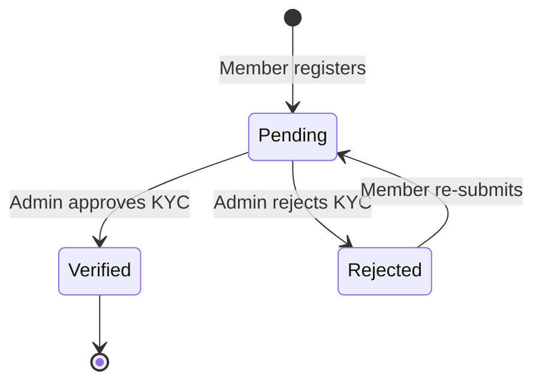
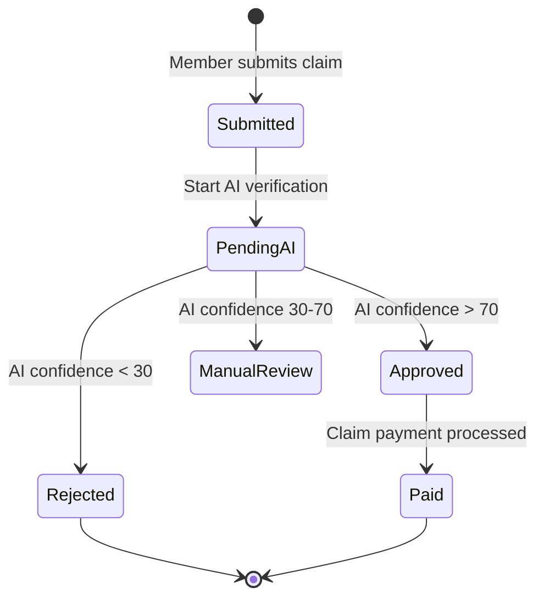
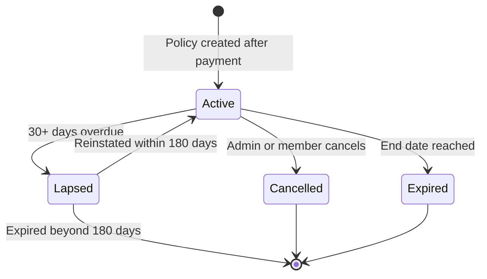

# Glossary of Terms

---

## Domain Terminology

| Term | Definition | Used In | Related Entities |
|------|------------|---------|------------------|
| **Member** | A registered user who can purchase insurance policies and submit claims. Each member has a unique email and password. | `Member` entity, `MemberService`, `MembersController` | `Policy`, `Claim`, `KycDocument` |
| **Policy** | An active insurance contract issued to a member. Contains coverage amount, premium, start/end dates, dependents, and nominees. | `Policy` entity, `PolicyService`, `Policies` table | `Member`, `Plan`, `Dependent`, `Nominee`, `PremiumPayment` |
| **Plan** | A predefined insurance product with fixed coverage amount, duration, and premium calculation rules. Members select a plan when purchasing a policy. | `Plan` entity, `PlanService`, `PublicPlansController` | `Policy` |
| **Claim** | A request submitted by a member for reimbursement of medical expenses. Claims go through AI verification and admin review. | `Claim` entity, `ClaimService`, `Claims` table | `Member`, `Policy` |
| **Dependent** | A family member (spouse, child, parent) covered under a member's policy. Dependents increase the premium. | `Dependent` entity, `PolicyService` | `Policy` |
| **Nominee** | A beneficiary designated to receive claim payouts in case of the member's death. Multiple nominees can have percentage allocations. | `Nominee` entity, `PolicyService` | `Policy` |
| **Premium Payment** | A recurring payment made by the member to keep the policy active. Payments can be monthly, quarterly, half-yearly, or yearly. | `PremiumPayment` entity, `PaymentService`, `PremiumPayments` table | `Policy` |
| **KYC (Know Your Customer)** | Identity verification process required before purchasing a policy. Members upload documents (Aadhaar, PAN, Passport). | `KycDocument` entity, `KycService`, `KycDocuments` table | `Member` |
| **Grace Period** | 15-day window after premium due date where the policy remains active without penalty. | `GracePeriodService` | `PremiumPayment`, `Policy` |
| **Lapse** | Policy termination due to non-payment of premium for 30+ days beyond due date. | `Policy.Lapse()`, `GracePeriodService` | `Policy` |
| **Reinstatement** | Restoring a lapsed policy within 180 days by paying outstanding premiums plus a fee. | `GracePeriodService.ReinstatePolicyAsync()` | `Policy` |

---

## Technical Architecture Terms

| Term | Definition | Implementation |
|------|------------|----------------|
| **Aggregate Root** | A domain entity that ensures consistency for a group of related objects. External references only go through the root. | `Member`, `Policy`, `Claim` |
| **Value Object** | An immutable object identified by its attributes, not an ID. | `Money`, `Address` |
| **Repository** | A pattern that abstracts data access, presenting a collection-like interface for aggregates. | `IMemberRepository`, `MemberRepository` |
| **Unit of Work** | A pattern that groups multiple operations into a single transaction. | `CmsDbContext.SaveChangesAsync()` |
| **DTO (Data Transfer Object)** | A simple object for transferring data between API and client, containing no business logic. | `SubmitClaimRequest`, `LoginResponse` |
| **Thin Controller** | A controller that delegates all business logic to services, only handling HTTP concerns. | All controllers in `CMS.API/Controllers/` |
| **JWT (JSON Web Token)** | A stateless authentication token containing claims (MemberId, Email, Role). | `JwtTokenGenerator.cs` |
| **Interceptor (Angular)** | A function that intercepts HTTP requests/responses to add headers or handle errors. | `jwt.interceptor.ts`, `http-error.interceptor.ts` |
| **Guard (Angular)** | A function that protects routes by checking authentication or KYC status before navigation. | `authGuard`, `kycGuard`, `adminGuard` |
| **Standalone Component** | An Angular component that does not belong to an NgModule, enabling lazy loading and tree-shaking. | All components in `src/frontend/src/app/` |
| **Background Job** | A task executed asynchronously outside the HTTP request pipeline. | Hangfire jobs (grace period reminders) |

---

## Database Terms

| Term | Definition | Table |
|------|------------|-------|
| **Primary Key (PK)** | A unique identifier for each row in a table. | `MemberId` in `Members` table |
| **Foreign Key (FK)** | A column that references the primary key of another table, establishing a relationship. | `MemberId` in `Claims` table → references `Members.MemberId` |
| **Index** | A database structure that speeds up query performance. | `IX_Members_Email` |
| **Migration** | A version-controlled change to the database schema. | `20260606173901_AddPremiumConfigurationToPlan.cs` |
| **CASCADE Delete** | Automatically deleting child rows when the parent row is deleted. | `Policies` → `Dependents` (CASCADE) |
| **RESTRICT Delete** | Preventing deletion of a parent row if child rows exist. | `Members` → `Policies` (RESTRICT) |
| **Owned Type** | A value object mapped to columns in the parent table (no separate table). | `Address` owned by `Member` |
| **Value Converter** | A mapping between a domain type and a database column type. | `Money` ↔ `decimal` |

---

## Business Process Terms

| Term | Definition | States/Transitions |
|------|------------|-------------------|
| **KYC Status** | Current state of a member's identity verification. | `Pending` → `Verified` / `Rejected` |
| **Policy Status** | Current state of an insurance policy. | `Active` → `Lapsed` / `Cancelled` / `Expired` |
| **Claim Status** | Current state of a claim submission. | `Submitted` → `PendingAI` → `Approved` / `Rejected` → `Paid` |
| **Payment Status** | Current state of a premium payment. | `Pending` → `Completed` / `Failed` |
| **Member Role** | Authorization level for system access. | `Member`, `Admin`, `ClaimsProcessor` |

---

## External Service Terms

| Term | Definition | Integration Type |
|------|------------|-----------------|
| **Groq AI** | Cloud-based LLM service (Llama 3.3 70B) used for automated claim verification. | REST API |
| **Hangfire** | .NET background job library that persists jobs to SQL Server. | SQL Server queue |
| **SMTP** | Simple Mail Transfer Protocol – used to send emails via Gmail. | SMTP with STARTTLS |
| **Azure Blob Storage** | Microsoft's object storage service for documents and files. | Azure SDK |
| **Razorpay / Stripe** | Payment gateways for processing premium payments (currently in mock mode). | REST API (planned) |

---

## File Paths Reference

| Term | File Path |
|------|-----------|
| **Domain Entities** | `src/backend/CMS.Domain/Entities/` |
| **Value Objects** | `src/backend/CMS.Domain/ValueObjects/` |
| **Enums** | `src/backend/CMS.Domain/Enums/` |
| **Application Services** | `src/backend/CMS.Application/Services/` |
| **DTOs** | `src/backend/CMS.Application/DTOs/` |
| **Repository Interfaces** | `src/backend/CMS.Application/Interfaces/Repositories/` |
| **Repository Implementations** | `src/backend/CMS.Infrastructure/Repositories/` |
| **EF Core Configurations** | `src/backend/CMS.Infrastructure/Data/Configurations/` |
| **Migrations** | `src/backend/CMS.Infrastructure/Migrations/` |
| **API Controllers** | `src/backend/CMS.API/Controllers/` |
| **Angular Components** | `src/frontend/src/app/` |
| **Angular Services** | `src/frontend/src/app/services/` |
| **Angular Guards** | `src/frontend/src/app/guards/` |
| **Angular Interceptors** | `src/frontend/src/app/interceptors/` |

---

## Acronyms

| Acronym | Full Form |
|---------|-----------|
| **ADR** | Architecture Decision Record |
| **API** | Application Programming Interface |
| **C4** | Context, Containers, Components, Code (modelling) |
| **CMS** | Claim Management System (this project) |
| **DDD** | Domain-Driven Design |
| **DI** | Dependency Injection |
| **DTO** | Data Transfer Object |
| **EF Core** | Entity Framework Core |
| **ERD** | Entity Relationship Diagram |
| **FK** | Foreign Key |
| **HA** | High Availability |
| **HTTP** | Hypertext Transfer Protocol |
| **HTTPS** | HTTP Secure |
| **JWT** | JSON Web Token |
| **KYC** | Know Your Customer |
| **LINQ** | Language Integrated Query |
| **LLM** | Large Language Model |
| **ORM** | Object-Relational Mapping |
| **OTP** | One-Time Password |
| **PK** | Primary Key |
| **REST** | Representational State Transfer |
| **RPO** | Recovery Point Objective |
| **RTO** | Recovery Time Objective |
| **SLA** | Service Level Agreement |
| **SMTP** | Simple Mail Transfer Protocol |
| **SPA** | Single Page Application |
| **SQL** | Structured Query Language |
| **TLS** | Transport Layer Security |
| **UI** | User Interface |
| **URL** | Uniform Resource Locator |

---

## State Transition Diagrams

### KYC Status Flow

### Claim Status Flow

### Policy Status Flow

---

## Quick Reference – Common Tasks

| Task | Service Method | Controller Endpoint |
|------|---------------|---------------------|
| Register new member | `IAuthService.RegisterAsync()` | `POST /api/auth/register` |
| Login | `IAuthService.LoginAsync()` | `POST /api/auth/login` |
| View dashboard | `IMemberService.GetMyDashboardAsync()` | `GET /api/v1/members/me` |
| Submit claim | `IClaimService.SubmitClaimAsync()` | `POST /api/v1/claims` |
| Upload KYC | `IKycService.SubmitKycDocumentsAsync()` | `POST /api/v1/kyc/upload` |
| Check KYC status | `IKycService.GetKycStatusAsync()` | `GET /api/v1/kyc/status` |
| Calculate premium | `IPremiumCalculatorService.CalculatePremiumAsync()` | `POST /api/v1/premium/calculate` |
| Assign plan | `IMemberService.AssignPlanAsync()` | `POST /api/v1/plans/assign` |
| Make payment | `IPaymentService.ProcessMockPaymentAsync()` | `POST /api/v1/payments/mock/{paymentId}` |
| View payment history | `IPaymentService.GetPaymentHistoryAsync()` | `GET /api/v1/payments/history` |

---

## Version History

| Version | Date | Changes |
|---------|------|---------|
| 1.0.0 | 2026-06-11 | Initial glossary for Claim Management System |

---

**Last Updated:** June 11, 2026