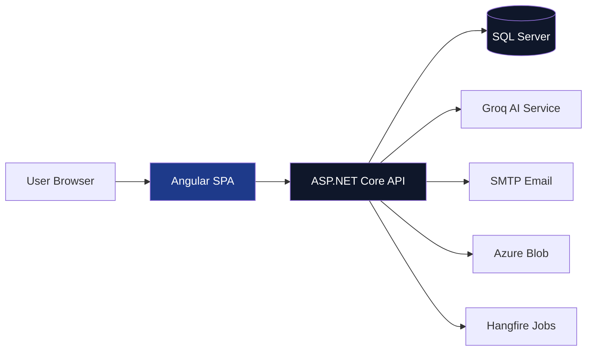

# Claim Management System – Technical Documentation

## Welcome

Welcome to the official technical documentation for the **Claim Management System (CMS)** – an enterprise-scale insurance platform built during internship training.

This documentation suite is designed for:

| Audience | Purpose |
|----------|---------|
| **Senior Management** | Understand architectural decisions, technology choices, and system capabilities |
| **Technical Trainers** | Evaluate depth of implementation, DDD patterns, and code organisation |
| **Development Team** | Onboard quickly, understand data flow, and maintain the system |

---

## Quick Navigation

| Document | Description |
|----------|-------------|
| [System Context](architecture/01-system-context.md) | External actors, integrations, and system boundaries |
| [Container Architecture](architecture/02-container-architecture.md) | Deployable units: Angular SPA, API, Hangfire, SQL Server |
| [Domain-Driven Design](backend/01-domain-driven-design.md) | Aggregates, entities, value objects (`Money`, `Address`) |
| [Application Layer](backend/02-application-layer.md) | Services, DTOs, and business workflows |
| [Repository Pattern](backend/03-repository-pattern.md) | Data access abstraction with EF Core |
| [Dependency Injection](backend/04-dependency-injection.md) | Service lifetimes and container configuration |
| [EF Core Configuration](backend/05-ef-core-configuration.md) | Fluent API, migrations, value conversions |
| [API Controllers](api/01-controllers.md) | Thin controllers, endpoints, authentication |
| [Middleware & Auth](api/02-middleware-auth.md) | JWT, global exception handling, role-based access |
| [Angular Structure](frontend/01-angular-structure.md) | Standalone components, lazy loading, routing |
| [Services & Interceptors](frontend/02-state-services-interceptors.md) | HTTP interceptors, guards, state management |
| [Database Schema](database/01-erd-and-schema.md) | Complete ERD with 10+ tables |
| [Migration Strategy](database/02-migration-strategy.md) | EF Core migrations history and commands |
| [ADR-001: ORM Choice](decisions/adr-001-orm-choice.md) | Why EF Core over Dapper |
| [ADR-002: Thin Controllers](decisions/adr-002-thin-controllers.md) | Why business logic stays in services |
| [Glossary](glossary.md) | Domain-specific terminology |

---

## System at a Glance



---

## Technology Stack Summary

| Layer | Technology | Version |
|-------|-----------|---------|
| Frontend | Angular | 21 |
| Frontend Styling | Tailwind CSS | 3.4 |
| Backend Runtime | .NET | 10 |
| Backend Framework | ASP.NET Core | 10 |
| ORM | Entity Framework Core | 10 |
| Database | SQL Server | 2022 |
| AI Verification | Groq (Llama 3.3 70B) | - |
| Background Jobs | Hangfire | 1.8 |
| PDF Generation | QuestPDF | 2026.6 |
| Email | MailKit (Gmail SMTP) | 4.17 |
| Authentication | JWT Bearer | - |
| Password Hashing | BCrypt | 4.2 |

---

## Recommended Reading Order

For first-time readers, follow this sequence to understand the full engineering journey:

1. [System Context](architecture/01-system-context.md) – Start here for the big picture
2. [Container Architecture](architecture/02-container-architecture.md) – Understand deployable units
3. [Domain-Driven Design](backend/01-domain-driven-design.md) – Core business model
4. [Application Layer](backend/02-application-layer.md) – Business workflows and DTOs
5. [Repository Pattern](backend/03-repository-pattern.md) – Data access strategy
6. [EF Core Configuration](backend/05-ef-core-configuration.md) – Database mapping details
7. [API Controllers](api/01-controllers.md) – REST surface area
8. [Middleware & Auth](api/02-middleware-auth.md) – Security and cross-cutting concerns
9. [Angular Structure](frontend/01-angular-structure.md) – Frontend architecture
10. [Services & Interceptors](frontend/02-state-services-interceptors.md) – HTTP layer and state
11. [Database Schema](database/01-erd-and-schema.md) – Full ERD reference
12. [ADR-001](decisions/adr-001-orm-choice.md) & [ADR-002](decisions/adr-002-thin-controllers.md) – Architectural rationale

---

## Key Metrics

| Metric | Value |
|--------|-------|
| Total Code Files | 150+ |
| Backend Projects | 5 (Domain, Application, Infrastructure, API, Tests) |
| Frontend Components | 30+ |
| Database Tables | 10 |
| EF Core Migrations | 5 |
| API Endpoints | 20+ |
| Services | 12 |
| Repositories | 6 |
| Route Guards | 4 |

---

## Project Structure

```text
ClaimManagementSystem/
├── doc/                          # 📘 You are here
│   ├── architecture/
│   ├── backend/
│   ├── api/
│   ├── frontend/
│   ├── database/
│   ├── deployment/
│   ├── decisions/
│   └── glossary.md
├── src/
│   ├── frontend/                 # Angular 21 SPA
│   │   ├── src/app/
│   │   ├── public/assets/
│   │   └── package.json
│   └── backend/                  # .NET 10 API
│       ├── CMS.Domain/           # Entities, Value Objects, Enums
│       ├── CMS.Application/      # Services, DTOs, Interfaces
│       ├── CMS.Infrastructure/   # Repositories, DbContext, Migrations
│       ├── CMS.API/              # Controllers, Middleware
│       └── CMS.Tests/            # Unit Tests
├── README.md
└── .gitignore
```

---

## Key Architectural Decisions

| Decision | Rationale | ADR Link |
|----------|-----------|----------|
| EF Core as ORM | LINQ support, migration tooling, value object mapping | [ADR-001](decisions/adr-001-orm-choice.md) |
| Thin Controllers | Testability, separation of concerns, reusability | [ADR-002](decisions/adr-002-thin-controllers.md) |
| DDD Tactical Patterns | Encapsulation of business rules, maintainability | [Domain Design](backend/01-domain-driven-design.md) |
| JWT Authentication | Stateless, scalable, microservices-ready | [Middleware & Auth](api/02-middleware-auth.md) |
| Standalone Angular Components | Tree-shaking, simpler mental model | [Angular Structure](frontend/01-angular-structure.md) |

---

## External Integrations

| Integration | Purpose | Fallback |
|-------------|---------|---------|
| Groq AI (Llama 3.3) | Claim verification | Mock AI with strict rules |
| Gmail SMTP | Email notifications | Logging only (development) |
| Azure Blob Storage | Document storage | Local file system (development) |
| Hangfire | Background jobs | In-memory (development) |
| Razorpay/Stripe (Mock) | Premium payments | Mock payment gateway |

---

## Status Legend

| Icon | Meaning |
|------|---------|
| ✅ | Complete / Implemented |
| 🔄 | In Progress |
| 📋 | Planned |
| ⚠️ | Needs Review / Mock Mode |

---

## Contributing

This documentation is maintained alongside the codebase in the `doc/` directory. To update:

1. Edit the relevant `.md` file
2. Run `mkdocs serve` to preview locally
3. Commit changes to version control

**Build Command:**

```bash
mkdocs build --clean
```

**Deploy Command:**

```bash
mkdocs gh-deploy --force
```

---

## Support

For questions about this documentation or the system architecture:

- **Technical Lead:** mittaljatin2004@gmail.com
- **Repository:** [github.com/claimcore/claim-management-system](https://github.com/Jat21in/claim-management-system/tree/main)

---

*Last Updated: June 11, 2026*
*Documentation Version: 1.0.0*
*Built with: [MkDocs Material](https://squidfunk.github.io/mkdocs-material/)*